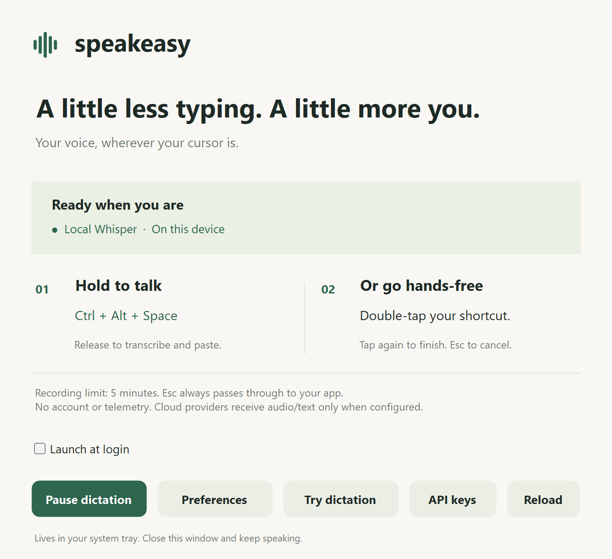

# speakeasy

## Rust rewrite

The Rust implementation is in `crates/`: a shared GPUI interface, a small
gesture/motion core, and Windows/macOS adapters. It implements local dictation
with the Tally pill, hold/double-tap gestures, Escape cancellation, a five-minute
cap, tray controls, and clipboard or direct text insertion. Automatic editing
is outside this rewrite's scope. The Windows Release demo and prerecorded
recognition are verified; microphone-to-editor and native Mac acceptance remain.
The .NET application below remains available.

### Build and run

Use the pinned Rust toolchain. Windows builds need Visual Studio C++ Build Tools
and the Windows SDK; macOS builds need Xcode command line tools. Initial native
targets are Windows 11 x64 and macOS 14+ on Apple Silicon.

```sh
cargo build --locked -p speakeasy
cargo run --locked -p speakeasy -- --demo
```

`--demo` runs a simulated motion preview without microphone, global shortcut,
model, or clipboard access. Linux supports this preview only; GPUI's X11 build
needs ALSA, fontconfig, X11/XCB, xkbcommon, and Vulkan development dependencies.

For dictation, run the app, choose an engine and its executable and model in
Settings, and select **Enable dictation**. Whisper is the default engine. Settings
also select your microphone, language, GPU use, clipboard behavior, and reduced
motion. Changes apply when you save; appearance, microphone, and language changes
keep the loaded model warm.

For a separate configuration, copy `rust-settings.example.json`, set its paths,
and run:

```sh
cargo run --locked -p speakeasy -- --config rust-settings.json
```

Use a local whisper.cpp server and a compatible GGML model. Windows fixture checks
cover v1.8.3 and [v1.9.4's b5130 binaries](https://github.com/ggml-org/whisper.cpp/releases/tag/b5130)
(GitHub labels the binary release as a prerelease).
The newer CUDA 12.4 build was faster on the measured RTX 4090, with a larger
runtime download; see the performance audit below. Relative paths resolve beside
the settings file.
The app owns a loopback-only server and keeps its model warm. With GPU preference
enabled, cancellation disconnects inference and checks the worker in the background
before reusing it. If recovery fails or takes more than two seconds, the worker is
terminated and replaced. CPU cancellation replaces the worker. No audio files,
transcripts, or provider output are logged. Microphone capture starts only when
you trigger dictation. Selecting a missing microphone produces an error; the app
does not silently switch devices.

Choose an engine built for your hardware: a GPU backend or an optimized CPU build.
A generic scalar CPU build can be much slower. **Prefer GPU** allows the selected
engine to use its GPU backend; it cannot add GPU support to a CPU-only executable.
Turn **Prefer GPU** off for a CPU-only engine to skip unnecessary kernel warmup.
With that preference enabled, loading includes a short synthetic-silence request
to initialize inference kernels before your first dictation. First-time GPU setup
can take several seconds; its output is discarded.
The separately generated `artifacts/rust/whisper-cpu-avx2.zip` is an optional CPU
engine requiring AVX2, FMA, F16C, and SSE4.2. It is never selected automatically.
For the measured RTX 4090, prefer the newer CUDA build: its native GPU kernels
avoid the old bundle's roughly ten-second first-use compilation. The verified
upstream ZIP is staged at `artifacts/rust/whisper-cuda-b5130.zip`; extract it and
select `Release/whisper-server.exe`. The engine remains separate from the app.
The app uses Whisper's normal segmentation for long recordings; inserted text
contains no timestamps. See the audit for accuracy and latency measurements,
including the decoding settings used by earlier performance comparisons.
The `threads` JSON setting can be tuned per machine; the default remains four.
Quit the app before editing JSON directly, then restart to load those changes.
See [the performance audit](docs/performance-audit.md) for measured gains and limits.

### Optional Parakeet engine

The self-contained Windows NVIDIA-GPU bundle is generated locally at
`artifacts/rust/speakeasy-windows-parakeet-x64.zip`. Extract its entire
`Speakeasy` folder to a Windows drive and run **Speakeasy.cmd**. It includes the
verified engine, model and relative-path settings; no download or path editing
is needed. It uses its own settings file and enables dictation on launch.
`Speakeasy.cmd --demo` opens the simulated preview instead. The smaller
`speakeasy-windows-x64.zip` still contains only the app and settings example.
Generated packages and models are excluded from Git.

To recreate the full bundle from the built executable and assets listed below:

```powershell
./scripts/package-rust-parakeet-windows.ps1 -RuntimeDirectory <extracted-nemo-release> -Model <parakeet-v3-q8.gguf>
```

**Engine: Parakeet** uses NVIDIA's NeMo-Speech.cpp with a Parakeet v3 model.
It requires GPU acceleration and detects the language automatically. Choose the
matching executable and GGUF model, then save. Existing configurations keep
Whisper; switching engines is always explicit. The JSON setting is
`"engine": "parakeet"`; `whisper_server` remains the executable path for either
engine for compatibility. The `threads` setting applies only to Whisper.

Verified on Windows with an RTX 4090:

- [NeMo-Speech.cpp v0.1.0 CUDA ZIP](https://github.com/NVIDIA/NeMo-Speech.cpp/releases/download/v0.1.0/nemo-speech-0.1.0-windows-x86_64-cuda.zip).
  Extract the complete archive and choose `bin/nemo-speech.exe`.
  SHA-256: `ba024204e76ca2fa4eefa8787506c3c49e418147f627f60cf9206a582b60089c`.
- [NVIDIA Parakeet TDT 0.6B v3 q8 GGUF](https://huggingface.co/nvidia/parakeet-tdt-0.6b-v3/resolve/541d1f99c6b0c3cd0b11a95167540bb8edefd82b/parakeet-tdt-0.6b-v3.q8_0.gguf),
  by NVIDIA, distributed under [CC BY 4.0](https://creativecommons.org/licenses/by/4.0/).
  SHA-256: `e3880d0aaaaf2c308ea2c35016b2b895c423eb3fda924c1b463d1c19b7f4d32e`.

The fixture checks showed fewer word errors overall and faster insertion through
the mocked controller, with slightly different punctuation. Accuracy varies by
recording. This engine held about **3.8 GB of dedicated GPU memory** after a
five-minute recording on this machine; Windows private commit was about 10 GB.
**Pause dictation** releases the model. Cancellation responds immediately while
the worker finishes its current request in the background; if recovery exceeds
two seconds, the app stops and reloads it. Microphone audio must be 8–96 kHz;
48 kHz is a suitable OS setting. CPU-only Parakeet and native Mac acceptance have
not been verified. See the performance audit for exact measurements and limits.

Without `--config`, settings are read from `%APPDATA%/speakeasy/rust-settings.json`
on Windows or `~/Library/Application Support/speakeasy/rust-settings.json` on Mac.
Close the .NET app before starting Rust, since both use the same default shortcut.
Closing Settings leaves dictation in the tray; use **Pause dictation** to release
the shortcut and model, or **Quit** to stop the app.

Hold **Ctrl+Alt+Space** to dictate, double-tap for hands-free, tap again to finish,
or press **Escape** to cancel. On Mac, Alt is Option. Text goes to the app focused
when insertion occurs. Standard mode leaves the transcript on the clipboard;
`preserve_clipboard: true` uses direct Unicode input instead, which some editors
reject. Protected fields and elevated Windows apps may reject either method.
An OS input submission cannot confirm that an editor accepted the text.

For local packaging, run `scripts/package-rust-windows.ps1` on Windows or
`bash scripts/package-rust-macos.sh` on Mac. The Mac bundle includes the microphone
usage declaration and a local signature; grant Microphone and Accessibility
permissions to that bundle. These scripts package the app, not models or the
Whisper runtime. Mac distribution signing/notarization is still pending.

```sh
cargo fmt --all --check
cargo clippy --workspace --all-targets --locked -- -D warnings
cargo test --workspace --locked
```

Default tests use mocked microphone, inference, and insertion ports around the
real session owner. They never record, install a global hook, or modify the
clipboard. A separate ignored provider test accepts public prerecorded audio:

```sh
SPEAKEASY_FIXTURE_CONFIG=/path/to/settings.json \
SPEAKEASY_FIXTURE_WAV=/path/to/whisper.cpp/samples/jfk.wav \
cargo test -p speakeasy local_worker_recognizes_fixture_and_stops -- --ignored
```

With the same variables, `cargo test -p speakeasy profile_fixture_dictation --
--ignored --nocapture` measures the real controller and provider through fake
capture and insertion. It excludes microphone teardown, audio preparation, and
OS paste latency; it is not a microphone-to-editor acceptance check.

On an available Windows desktop, `scripts/check-rust-demo-windows.ps1
-Executable <path-to-speakeasy.exe>` checks the visible demo's focus and hit
testing without recording, injecting input, or changing the clipboard.
Native build/package jobs are in `.github/workflows/rust.yml`. See
[handoff.md](handoff.md) for the checks actually run and remaining native limits.

## Existing .NET application

The rest of this README describes the existing .NET app. Its setup commands,
settings and cleanup features are separate from the Rust implementation above.

System-wide AI dictation for Windows. Hold a shortcut, speak, and release to put polished text at your cursor. Speakeasy runs in the system tray, with a small floating pill while the microphone is live.

The app uses native Windows input and clipboard APIs, .NET 10 WinForms, local whisper.cpp speech recognition, and optional local or cloud text cleanup. The fully local setup needs no account, API key, or network connection after installation. Speakeasy has no telemetry or transcript history.



## Install and start

If you have the packaged ZIP, extract it and open `speakeasy.exe`. The local
model setup script is included in `scripts/`. For source builds, use the steps
below. Your installed copy can be opened again to bring its dashboard forward.

Use Windows 11 x64. Building from source requires the .NET SDK pinned in [global.json](global.json); the published app includes its .NET runtime. Run these commands in PowerShell from the repository directory:

```powershell
dotnet restore Speakeasy.sln --locked-mode
./scripts/setup-local.ps1 -Backend cuda -Model medium.en -IncludeCleanup
./scripts/install.ps1 -Launch
```

This installs the app under `%LOCALAPPDATA%\Programs\speakeasy`, creates a Start Menu shortcut, and opens Speakeasy. The CUDA setup downloads whisper.cpp, the English medium Whisper model, llama.cpp, and the Qwen2.5 3B Instruct model for local cleanup. It sets the actual executable and model paths in `%APPDATA%\speakeasy\settings.json`. Downloads require internet access and several gigabytes of disk space; normal local dictation does not.

For a machine without a compatible NVIDIA GPU, use CPU builds and the smaller model:

```powershell
./scripts/setup-local.ps1 -Backend cpu -Model small.en -IncludeCleanup
```

The setup script supports `small.en`, `small`, `medium.en`, and `medium`. Choose a model without `.en` for multilingual recognition and set `transcription.language` to the appropriate language code or `auto`. Running setup again selects the local provider and updates its model/backend settings. It preserves other setting values, fills omitted defaults, and writes ordinary JSON without retaining comments. Choose **Reload settings** in the tray menu afterward.

To run directly from source:

```powershell
dotnet run --project src/Speakeasy.App -- --settings
```

Source runs and the installed app share the default configuration directory. If
you install with a custom configuration directory, pass the same `--config-dir`
when running from source. Only one tray instance runs at a time. Closing the
main window leaves dictation available in the tray; choose **Quit** to close it completely.

## Everyday use

| Action | Result |
| --- | --- |
| Hold **Ctrl+Alt+Space**, speak, then release | Records while held, transcribes, cleans up if configured, and pastes. Release the modifier keys so they do not interfere with paste. |
| Double-tap the shortcut | Starts hands-free recording. Nothing needs to remain held. |
| Tap once during hands-free recording | Stops recording and inserts the result. |
| Press **Esc** | Discards active audio or cancels transcription/cleanup. Escape also reaches the app you are typing in. |
| Disable dictation in the tray | Cancels the current session and pauses the shortcut. |

The first tap of a double-tap must last at most **220 ms**; press the shortcut again within **300 ms** after releasing it. A short single tap waits through this window before it finishes, so the opening words of a hands-free session are retained. These timings are adjustable.

Every recording stops automatically after **five minutes**, including hold-to-talk. A shorter limit is configurable; a longer limit is rejected. Locking Windows, logging off, disconnecting the session, or suspending the PC cancels active work. Silence and very short accidental recordings are skipped.

The pill shows the recording mode, elapsed time, and microphone level, then the processing stage. It does not take keyboard focus. The result goes to the editable field that has focus **when insertion happens**; keep your intended destination focused while transcription finishes. Escape cannot retract text after Windows has already received the input.

Double-click the tray icon to open Speakeasy. **Preferences** provides the common microphone, shortcut, provider, cleanup, and clipboard controls. The tray also offers **Dictation enabled**, **Launch at login**, **Edit settings**, **Edit API keys (.env)**, **Reload settings**, and **Quit**. Launch at login applies only to your Windows user and does not require administrator access.

Use **Try dictation** for a practice text box with Start and Finish buttons.
It uses your normal microphone, models, shortcut, and clipboard preferences;
its text is kept only while the window is open. In Preferences, **Check
microphone** shows a live input meter for ten seconds and discards the audio.
Use it to confirm a new microphone or remote audio connection before dictating.

## Windows permissions and keyboard behavior

In **Settings → Privacy & security → Microphone**, enable **Microphone access**, **Let apps access your microphone**, and **Let desktop apps access your microphone**. Speakeasy is a desktop app. Select the intended recording device in Preferences or use the Windows default. See [Microsoft's microphone permission instructions](https://support.microsoft.com/en-us/windows/privacy/turn-on-app-permissions-for-your-microphone-in-windows).

**Accessibility** and **Input Monitoring** permissions are macOS settings; Windows has no corresponding permission panels to grant for this app. Speakeasy observes its shortcut through a Windows keyboard hook and pastes with **Ctrl+V**.

The **Fn** key is often handled inside keyboard firmware and never produces an observable Windows key event. Speakeasy therefore rejects `Fn` as a shortcut. If your keyboard's own software or firmware can remap Fn to **F13**, configure `F13` in Speakeasy. Otherwise choose an observable key such as `RightAlt`, `F8`, or `Ctrl+Alt+Space`. A remapping utility cannot recover a key event the keyboard never sends. Side-specific modifiers and F1–F24 are supported; Escape is reserved for cancellation.

Windows can block automatic input into applications running as administrator. On the normal clipboard path, Speakeasy leaves the transcript copied and asks you to press **Ctrl+V** in the target app. When direct insertion is required to preserve an unreadable previous clipboard, it leaves that clipboard untouched and reports the blocked input. Secure desktops and applications that reject paste are outside normal automatic insertion support. This follows Windows' [SendInput integrity-level restrictions](https://learn.microsoft.com/en-us/windows/win32/api/winuser/nf-winuser-sendinput).

## Moonlight and Sunshine

Speakeasy accepts shortcut and Escape events sent through Sunshine, including
Windows-injected keyboard input. The app runs on the streamed Windows desktop
and inserts text into the focused app on that desktop.

The microphone also needs to reach the Windows host. Stock Moonlight/Sunshine
does not automatically turn the client's microphone into a Windows recording
device; upstream [microphone forwarding remains an open feature](https://github.com/moonlight-stream/moonlight-qt/pull/1648).
Use a microphone connected to the host, or route the client's microphone through
an audio receiver into a host recording device. Then select that device in
Speakeasy Preferences. See the [remote dictation setup](docs/remote-dictation.md)
for the existing Voicemeeter and VB-CABLE options and a routing check.

## Clipboard behavior

By default, the last result remains on the clipboard, so you can paste it again. Set `restoreClipboard` to `true` to restore the previous contents after automatic paste. `clipboardRestoreDelayMs` defaults to **800 ms**.

Restoration captures the available clipboard formats before replacement and only restores if the clipboard still contains Speakeasy's result. A newer copy from another app wins. Applications that read the clipboard unusually late may need a longer delay.

If custom or delayed formats prevent a complete snapshot, Speakeasy leaves the
whole clipboard untouched and inserts directly. Standard Windows Edit/RichEdit
controls, including Notepad, receive an undoable text insertion; other apps
receive paced Unicode input. Some custom editors reject direct input or its
paragraph breaks. Use the default clipboard mode for an app that needs paste.
The dashboard and practice window show the current insertion notice.

Windows confirms that input was delivered, not that every target accepted it.
When the normal paste path is blocked, the transcript remains copied for manual
Ctrl+V. Direct insertion instead keeps the previous clipboard and reports the
problem; it never claims that an uninserted transcript was copied.

## Settings and providers

Configuration lives in `%APPDATA%\speakeasy`:

| File or folder | Purpose |
| --- | --- |
| `settings.json` | Shortcut, audio, provider, cleanup, and clipboard preferences. |
| `.env` | Optional provider keys. Never put keys in `settings.json`. |
| `models/` | Downloaded Whisper and local cleanup models. |
| `tools/` | Local inference executables and their dependencies. |
| `downloads/` | Downloaded installation archives. |

[settings.example.json](settings.example.json) contains every supported setting. JSON comments and trailing commas are accepted; unknown setting names are rejected to catch typos. Relative executable/model paths resolve against the configuration directory. Changes to JSON or `.env` take effect after **Reload settings**. Process environment variables override `.env` values; the app does not alter the global environment.

Useful settings include `hotkey`, `doubleTapMs`, `tapMaxMs`, `maxRecordingSeconds`, `microphoneDevice` (`-1` means Windows default), `silenceThreshold`, and `restoreClipboard`. For a separate configuration directory, start with `--config-dir "C:\path\to\configuration"`.

### Local speech and cleanup

`transcription.provider` defaults to `local`. Adding an API key never switches local speech recognition to the cloud.

`cleanup.provider` accepts `auto`, `none`, `local`, `groq`, or `openai`:

| Cleanup choice | Behavior |
| --- | --- |
| `auto` with local transcription | Keeps the raw Whisper text; makes no cloud request. |
| `auto` with Groq/OpenAI transcription | Uses the same cloud provider for cleanup. |
| `local` with `autoStartLocal: true` | Speakeasy starts and owns the installed llama.cpp model. Configured by `setup-local.ps1 -IncludeCleanup`. |
| `local` with `autoStartLocal: false` | Uses your already-running OpenAI-compatible server at `cleanup.endpoint`; specify its `cleanup.model`. Only loopback URLs are accepted. |
| `none` | Inserts the raw transcript. |

For an existing local server such as Ollama, set `cleanup.provider` to `local`, `cleanup.autoStartLocal` to `false`, `cleanup.endpoint` to its OpenAI-compatible base URL, such as `http://localhost:11434/v1`, and `cleanup.model` to a model you have installed. An optional `LOCAL_LLM_API_KEY` is sent only to that local endpoint.

The cleanup prompt removes filler words and accidental repetitions, fixes punctuation, and preserves meaning and language. It treats dictated commands and questions as text to edit. `cleanup.style` supports `natural`, `sentence`, and `lowercase`. If cleanup fails or times out, Speakeasy inserts the original transcript with a notice. Cancellation discards the result instead. Use `none` when you want the original recognition output without an LLM edit.

### Optional cloud providers

Put the applicable key in `%APPDATA%\speakeasy\.env`, using [.env.example](.env.example) as a reference:

```dotenv
GROQ_API_KEY=your-key
OPENAI_API_KEY=your-key
```

Set `transcription.provider` explicitly to `groq` or `openai`. Leave `transcription.model` empty to select the provider's default here: `whisper-large-v3-turbo` for Groq, or `whisper-1` for OpenAI. The implementation uses their documented [Groq speech-to-text](https://console.groq.com/docs/speech-to-text) and [OpenAI file transcription](https://developers.openai.com/api/docs/guides/speech-to-text) endpoints.

With cloud cleanup, an empty `cleanup.model` selects `llama-3.3-70b-versatile` for Groq or `gpt-4.1-mini` for OpenAI. Models are configurable; consult the [Groq model catalog](https://console.groq.com/docs/models) and [OpenAI model documentation](https://developers.openai.com/api/docs/models/gpt-4.1-mini) for availability. These providers use your own API credentials and may charge for requests. There is no automatic cloud fallback if a local model fails.

Local speech plus local cleanup keeps audio and text on the machine. Cloud transcription sends the recording to the selected provider; cloud cleanup sends the transcript to its selected provider. Speakeasy does not log audio, keys, provider response bodies, or ordinary dictated text. Windows clipboard history/sync and the destination app follow their own settings.

## Performance and local model lifetime

The default local mode is `server`: a hidden, owned `whisper-server.exe` keeps the model loaded between recordings. The optional owned `llama-server.exe` does the same for cleanup. Both bind only to loopback addresses and warm up asynchronously. They consume RAM and, with CUDA, GPU memory while resident. The microphone is opened only during recording.

Escape aborts an active local inference by terminating that owned worker. The next session starts a fresh worker, so its first result may take longer. Quitting or reloading settings closes the old workers. Pausing dictation stops input but keeps already-loaded models available.

Set `transcription.localMode` to `cli` to run whisper.cpp separately for each recording. This releases the model after every invocation but adds model-loading time. If server mode is selected and its executable is absent, Speakeasy uses the configured CLI; a present but failing server reports an error. `transcription.useGpu`, `transcription.threads`, `transcription.timeoutSeconds`, and `transcription.startupTimeoutSeconds` control execution. CPU use is available for both local models.

Actual latency depends on recording length, model, backend, hardware, and whether models are already warm. The file diagnostic below measures warmup separately from three successive transcription/cleanup runs; no fixed latency is promised.

## Build, package, and verify

```powershell
dotnet restore Speakeasy.sln --locked-mode
dotnet build Speakeasy.sln -c Release --no-restore
dotnet test Speakeasy.sln -c Release --no-build --no-restore
dotnet format whitespace Speakeasy.sln --verify-no-changes --no-restore
powershell.exe -NoProfile -File tests/SetupDownload.Tests.ps1
./scripts/publish.ps1
```

Publishing creates a self-contained Windows x64 app in `artifacts/publish` and `artifacts/speakeasy-win-x64.zip`. `publish.ps1 -OutputDirectory` and `install.ps1 -InstallDirectory -ConfigDirectory` allow custom locations. Installation does not change your launch-at-login preference.

Use `install.ps1 -DesktopShortcut` to add a desktop launcher. An installed
`config-location.txt` remembers a custom configuration folder even when opening
the executable directly. `--config-dir` overrides it. `speakeasy.exe --quit`
gracefully closes the running instance; the installer uses this when updating.

Tests cover gesture boundaries, cancellation, audio limits, clipboard ownership, provider requests, and owned process termination. Default repeatable tests use fakes or explicit fixtures and do not record the live microphone or type into your applications. Explicitly authorized interactive acceptance is recorded separately in the [verification notes](docs/VERIFIED.md). The project adopts a small, scoped set of [repository standards](docs/standards.md); see [architecture](docs/architecture.md) for component and lifetime details.

For an explicit diagnostic with a known **16 kHz mono PCM16 WAV** fixture:

```powershell
dotnet run --project src/Speakeasy.App -- --transcribe-file "C:\fixtures\speech.wav" --result-file "C:\fixtures\speakeasy-result.json"
```

This opens no microphone and does not use the clipboard. It uses the configured providers, so a cloud configuration sends the fixture to that provider. The requested result JSON includes timings and transcript text; use a non-sensitive test fixture.

Before relying on a new microphone or shortcut, check the following in an editable test document:

- Hold, speak, release: the pill appears and text arrives at the cursor.
- Double-tap, speak with both hands free, tap once: recording stops and text arrives.
- Press Escape during recording and processing: the target app still receives Escape and no cancelled result appears later.
- Try the apps you normally type in; confirm manual Ctrl+V fallback in an elevated app.
- Copy a test value, enable clipboard restoration, and confirm it returns after paste; a newer copy should be preserved.
- Temporarily lower `maxRecordingSeconds` to check automatic stopping, then restore it; lock or suspend during a test recording and confirm cancellation.
