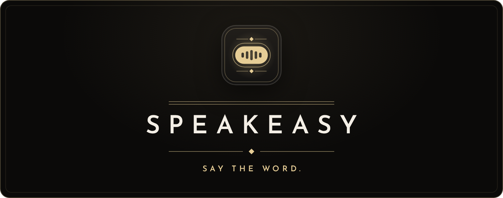
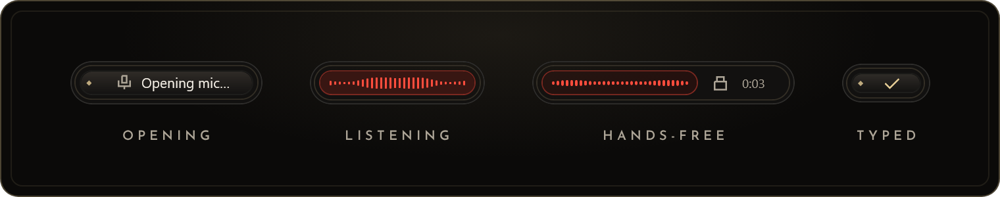

<p align="center">
  
</p>

<p align="center">
  <strong>Private dictation for Apple silicon Macs.</strong><br>
  Hold Fn, speak, and your words appear wherever you are typing.<br>
  Local speech. No account, no upload, no history.
</p>

<p align="center">
  <a href="#get-started">Get started</a>&nbsp;&nbsp;◆&nbsp;&nbsp;
  <a href="#speech-engines">Speech engines</a>&nbsp;&nbsp;◆&nbsp;&nbsp;
  <a href="#build-and-verify">Build and verify</a>&nbsp;&nbsp;◆&nbsp;&nbsp;
  <a href="docs/architecture.md">Architecture</a>
</p>

This branch is a performance fork of Speakeasy 0.3.3 for Apple silicon Macs only, built to measure
whether people can feel the difference. The [fork PRD](docs/apple-silicon-prd.md) owns its goals,
measurements, and acceptance gates.

## Say the word

A speakeasy was a room behind an ordinary door. You spoke at a small slot, the door opened, and what
was said inside stayed inside. Speakeasy works the same way: it waits in the menu bar, opens a small
slot on screen while you speak, and keeps every word on your Mac.

<p align="center">
  
</p>

| Gesture                                        | Shortcut                         |
| ---------------------------------------------- | -------------------------------- |
| Dictate while held; release to type            | <kbd>Fn</kbd>                    |
| Hands-free; press the shortcut again to finish | <kbd>Fn</kbd> + <kbd>Space</kbd> |
| Cancel; the key still reaches your app         | <kbd>Escape</kbd>                |

Double-tapping Fn also starts hands-free. Set **System Settings › Keyboard › Press 🌐 key to** to
**Do Nothing** so Fn only dictates. Recordings stop at five minutes, with a countdown for the last
30 seconds. A check means the text was submitted to your app; **No speech detected** means nothing
was sent. **Remove um / uh** is on by default and removes standalone English hesitation words
locally before insertion. Speech containing only these fillers sends nothing. Turn it off for
non-English Parakeet dictation or literal transcription; Whisper removes fillers only when its
language is set to English.

## What's said here stays here

- Speech runs locally in a process Speakeasy owns and stops: its own helper, which loads
  NeMo-Speech.cpp, or a whisper.cpp or NeMo-Speech.cpp server. Setup downloads the model once;
  nothing is uploaded.
- The microphone opens only while you dictate. Audio, transcripts, and engine output are never
  logged.
- There are no accounts, cloud providers, telemetry, or transcript history.

## Get started

Build the app bundle on a Mac with Apple silicon, macOS 14 or later, Xcode with its Metal toolchain,
CMake, and the Rust toolchain that `mise install` provides, then open it and allow Microphone and
Accessibility access when asked:

```sh
bash scripts/package-macos.sh
open artifacts/Speakeasy.app
```

The app carries its own Metal build of [NeMo-Speech.cpp](https://github.com/NVIDIA/NeMo-Speech.cpp),
tuned for Apple silicon. The first launch installs it and downloads NVIDIA's Parakeet v3 model,
about 0.7 GB, into `~/Library/Application Support/speakeasy`, then turns dictation on. The model
comes from a pinned Hugging Face revision and is checked against its SHA-256 before use. **Cancel**
pauses setup, and the next attempt resumes where it stopped. Then hold <kbd>Fn</kbd> in an editor
and speak. A configuration that automatic setup made earlier keeps its engine until you choose
**Install it** in Settings, which installs the bundled build and keeps the model; a manually chosen
engine is never replaced.

Settings also choose the microphone, GPU use, filler removal, clipboard behavior, reduced motion,
and theme: **Jet & Champagne**, **Emerald Lounge**, **Iris**, or **Midnight Chrome**. Changes apply
when you save. Changing the engine, its executable or model, threads, or GPU use reloads the model;
other changes keep it loaded. Saving stays responsive and preserves edits made while the save is
running. Pausing during a save keeps dictation paused; Quit finishes requested saves.

## Speech engines

**Parakeet** is the default: NVIDIA's Parakeet TDT 0.6B v3, run by NeMo-Speech.cpp on Metal. It
detects the language automatically and needs microphone audio at 8–96 kHz. **Prefer GPU** switches
between the GPU and the CPU. After a long stretch of speech without a half-second pause, the worker
can hold several gigabytes of unified memory until **Pause** releases it. The model is by NVIDIA,
under [CC BY 4.0](https://creativecommons.org/licenses/by/4.0/).

**Whisper** runs a local whisper.cpp server with a GGML model. Switch the engine under **Local
speech**, choose its executable and model, and save; switching is always explicit. Turn off **Prefer
GPU** for a CPU-only build. The `threads` setting applies to Whisper and defaults to four.

Parakeet runs in Speakeasy's own helper process, which loads the engine installation's library and
receives audio over a pipe; an installation without that library, or whose library this process
cannot load, runs the engine's server instead. The worker stays warm. With the GPU, one silent
request initializes its kernels before the first dictation. On the GPU, Speakeasy recognizes what
you have said whenever you pause, so when you release or stop 200 ms or more after your last word,
the text is usually ready at once. A recording that passes 20 seconds is divided at its half-second
pauses; on the GPU each part is recognized while you keep speaking, so stopping waits only for the
last stretch, and on the CPU the parts are recognized after you stop. A GPU transcription abandoned
by Escape or a new recording finishes unobserved and keeps its warm worker; one still running after
two seconds is cancelled and its worker replaced. Cancelling active CPU inference replaces the
worker. **Pause dictation** releases the shortcut and the model. Relative engine and model paths
resolve beside the settings file.

## Everyday use

Settings live in `~/Library/Application Support/speakeasy/settings.json`. Start from
`settings.example.json` and pass `--config <path>` to use another file. Configured launches go
straight to the menu bar. Closing Settings hides it and keeps unsaved edits. Reopening Speakeasy or
choosing **Settings…** in the menu brings it back. `speakeasy --toggle` and `speakeasy --cancel`
start, finish, or discard dictation in the running app, for scripts and launchers.

The menu bar icon shows loading, ready, recording, processing, paused, and attention states by
shape. Its menu pauses or resumes dictation, starts or finishes a recording, cancels, opens
Settings, and quits. Errors stay in Settings after the pill fades.

By default the text is pasted through the clipboard and stays there. **Keep clipboard** types it as
direct input instead, which some editors reject. Protected fields may refuse either method, and no
OS submission can confirm that an editor accepted the text.

## Build and verify

Use the pinned nightly Rust toolchain in `rust-toolchain.toml`; workspace dependencies are declared
centrally in the root `Cargo.toml`.

```sh
mise install
mise run standards:check
cargo run --locked -p speakeasy -- --demo   # simulated preview
cargo run --locked -p speakeasy             # the app
```

The pinned toolchain and lockfiles make the local and CI gate the same. It checks Rust formatting,
Clippy, docs, tests, unused dependencies, and the unsafe and lint-exception policy; Python
formatting, lint, types, and fixture tests; shell formatting, lint, and syntax; Markdown formatting,
structure, local links, and spelling; the CI workflow; and repository hygiene. `mise run standards`
applies safe formatters and autofixes. `mise tasks` lists focused checks such as
`mise run rust:lint` and `mise run py:test`.

`--demo` uses simulated audio without the microphone, global shortcut, model, or clipboard. It
previews hands-free, the countdown, submission, interrupted dismissal, cancellation, silence, and an
error. `--demo-tray` adds the menu bar item and the Settings hide-and-reopen behavior with dictation
disabled.

Default tests drive the real session owner with mocked microphone, inference, and insertion, and a
paused clock exercises gesture deadlines and the five-minute cap; the
[agent guide](AGENTS.md#tests-and-review) owns what they may touch. See the
[architecture change and test map](docs/architecture.md#change-and-test-map).

<details>
<summary>Packaging, fixture tests, and native checks</summary>

<br>

- `bash scripts/package-macos.sh` packages the app into `artifacts/`. It runs
  `scripts/build-engine.sh`, which fetches pinned NeMo-Speech.cpp, ggml, cpp-httplib, and
  SentencePiece sources, applies [Speakeasy's engine patches](packaging/engine/README.md), and
  builds for M1 and macOS 14. The bundle carries that engine but no model, its microphone usage
  declaration, and a local signature. Distribution needs Developer ID signing and notarization.
- With `SPEAKEASY_FIXTURE_CONFIG` pointing at a settings file, `SPEAKEASY_FIXTURE_WAV` at
  whisper.cpp's public `samples/jfk.wav`, whose phrase these tests check, and, for Parakeet,
  `SPEAKEASY_FIXTURE_HELPER` at a built `speakeasy` binary, since a test binary cannot run the
  helper:

  ```sh
  cargo test -p speakeasy-dictation local_worker_recognizes_fixture_and_stops -- --ignored
  cargo test -p speakeasy-dictation profile_fixture_dictation -- --ignored --nocapture
  ```

  The first checks recognition and worker shutdown. The second times the real session owner and
  engine with fake capture and insertion; it excludes microphone teardown and OS paste latency. With
  `SPEAKEASY_FIXTURE_WAV` and `SPEAKEASY_FIXTURE_HELPER`,
  `cargo test -p speakeasy-dictation install_chooses -- --ignored` runs setup into a temporary
  directory and recognizes the fixture; `SPEAKEASY_FIXTURE_ENGINE` names a `scripts/build-engine.sh`
  build to install instead of downloading NVIDIA's.

- `cargo run --release -p speakeasy-platform --example engine_profile` times warm recognition of
  public WAV fixtures through the engine's C library or its HTTP server; see
  [performance](docs/performance.md#measuring).
- `cargo run --locked -p speakeasy --example check_native_rendering -- --native-gui` opens an owned
  non-activating window, renders an embedded SVG and paths, resizes, and repeats show/hide. It runs
  on the process main thread for AppKit and accesses no microphone, global hook, or clipboard.
- `.github/workflows/checks.yml` runs the gate, the owned-window rendering check, and packaging on a
  macOS runner. This fork publishes no releases.

Live microphone-to-editor dictation still needs hands-on acceptance.

</details>

## Documentation

- [Architecture](docs/architecture.md): module ownership, sessions, recognition, and privacy.
- [Interaction design](docs/interaction-design.md): the brand, the pill, the menu bar item, and
  interaction contracts.
- [Performance](docs/performance.md): constraints, profiling methods, and native measurement limits.
- [Apple silicon fork PRD](docs/apple-silicon-prd.md): feature parity, performance measurements,
  perceptibility testing, and native acceptance, with
  [platform research](docs/apple-silicon-research.md) and the
  [comparison baseline](docs/apple-silicon-baseline.md).
