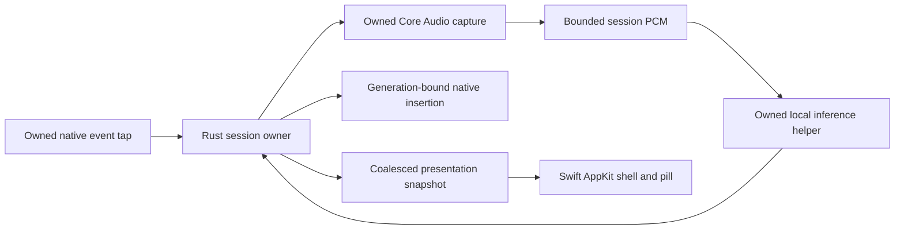

# Speakeasy Apple silicon fork experiment: draft PRD

Status: in progress, updated 2026-10-02 UTC. Target: Apple silicon Macs, macOS 14.0 or later. The
`high-perf-macos` branch is a macOS-only optimization fork that never merges into `main`. It keeps
the features and interaction of released Speakeasy 0.3.3 at
`f30791273cc4130c2073077df703794263a675a0` (tag `v0.3.3`) and has removed the Windows and Linux
adapters, packaging, and checks. It does not authorize publishing a release.

For this target, this document owns product requirements, performance decisions, and completion
gates. [Interaction design](interaction-design.md) owns exact visual and gesture behavior;
[Architecture](architecture.md) describes the existing implementation.
[Comparison baseline](apple-silicon-baseline.md) records the 0.3.3 source map, verification, and
historical measurements. [Platform research](apple-silicon-research.md) supplies primary sources and
API limitations. Follow the repository's [agent guide](../AGENTS.md) for privacy, native opt-in,
FFI, and verification.

## Objective and decision priority

Build an aggressively optimized macOS-only fork and determine whether users can perceive a
difference from 0.3.3 while using the same features. A user triggers dictation, speaks, releases,
and receives correct text in the application already in focus. Optimize the whole experience,
including cancellation and cleanup, while retaining warm model readiness and the same visual and
gesture behavior.

Report engineering gains and user-perceived gains separately. A faithful fork with a reproducible
resource improvement but no demonstrated perceptible difference is a useful result. An adequately
measured experiment finding no improvement is also complete; it does not require inventing another
optimization or publishing a replacement app. Unavailable native or perception evidence leaves that
question unresolved.

Correctness, recognition quality, privacy, accessibility, and feature parity are hard constraints.
Within them, prioritize warm stop-to-text tail latency, capture onset, presentation responsiveness,
energy per completed dictation, idle energy, and peak/retained memory. Report tradeoffs across that
sequence rather than hiding cost in another process, WindowServer, or the next request. Engineering
complexity does not disqualify a measured win. Language or framework preference does not establish a
win.

Do not lower model quality, omit hard cases, capture before user intent, remove features, unload a
ready model automatically, or report a faster subcomponent as a faster product. The shipping default
must pass quality and native interaction gates before its speed is considered. An optimization
remains experimental until the relevant gate passes.

## Status and next gates

The fork has removed Windows and Linux, extracted the GPUI-free service into `crates/dictation`, and
implemented these candidates. The full gate passes on GitHub's `macos-15` runner, including the app
build, tests, the owned-window rendering check, and packaging. None has been measured with a
microphone or a person, so each remains experimental under this PRD.

Engine measurements on an M4 Pro Mac mini (24 GB, macOS 27, warm, q8_0 model, Metal) on 2026-10-02
used the 48 kHz public fixtures, with interleaved blocks of six requests and identical text hashes
on every fixture:

- The engine is 80–93% of release-to-text. Its encoder, not transport, dominates: NVIDIA's HTTP
  server route costs 0.5–5 ms more than the helper up to a minute of audio and 35 ms at 290 s. A
  q8_0 model and an f16 conversion recognize at the same speed.
- Speakeasy's engine build cuts warm recognition from 29 to 21 ms at 1.3 s, 63 to 40 ms at 5 s, 106
  to 60 ms at 10 s, 318 to 168 ms at 30 s, 580 to 300 ms at 52 s, and 6.5 to 2.6 s at 290 s. Through
  the real session owner with fake capture and insertion, the 11-second JFK fixture's
  stop-to-insertion falls from 115 to 67 ms.
- A first helper start after an app build loads NVIDIA's engine in 7.1 s, mostly compiling its Metal
  source, and Speakeasy's build in 0.7 s; warm restarts take 0.14–0.16 s with either.
- Feed-forward matrix products are now about half of the encoder; the TDT decoder's CPU steps are
  bandwidth-bound at about 0.13 ms each.

| Candidate                                                          | Hypothesis                                                                                       | Regression guard                                                                                |
| ------------------------------------------------------------------ | ------------------------------------------------------------------------------------------------ | ----------------------------------------------------------------------------------------------- |
| Parakeet helper over pipes, via the engine's C ABI, replacing HTTP | Removes multipart upload, server WAV parsing, and JSON; grows with recording length              | Identical text hashes for helper and HTTP routes; helper exits when the app dies; HTTP fallback |
| Hands-free GPU pause speculation with byte-identical audio reuse   | Removes recognition from the stop path whenever the stop press comes 500 ms or more after speech | Paused-clock owner tests; a speculation can delay a request that resumes speech after a pause   |
| Trailing quiet beyond 500 ms trimmed (was kept below one second)   | Lets a stop 0.5–1 s after speech match its pause; slightly less audio to recognize               | Corpus check with 0.5 s and up to 1 s of trailing quiet                                         |
| Sealed audio reported before the device stops                      | Moves Audio Unit stop and dispose off release-to-sealed                                          | Quiescence test; native `release→sealed` and `device` timings                                   |
| Ring drained every 16 ms once audio flows (was 5 ms)               | About a third of the consumer wakeups while recording                                            | Meter cadence unchanged at 32 ms; finish and cancel still wake at once                          |
| Modifier release rechecked every 2 ms (was 10 ms)                  | Speculated text is often ready while the stopping press is still down                            | Insertion eligibility tests                                                                     |
| Speakeasy's engine build bundled in the app                        | Engine graph changes and a compiled Metal library cut recognition and cold model loading         | Identical fixture hashes per change; original graphs behind `NEMO_SPEECH_LEGACY_*`; bundle test |

`SPEAKEASY_TIMING=1` reports each session's stage timings, `engine_profile` compares the helper and
HTTP routes and varies warmup length, idle gaps, and a shortcut-press primer, and `capture_onset`
splits microphone startup into stages. [Performance](performance.md#measuring) gives their commands.

Run the next gates on the reference Macs in order, keeping raw output under `artifacts/`:

1. Build with `bash scripts/package-macos.sh`, complete setup with the development bundle and a
   temporary `--config`, and confirm that dictation runs a `--speech-helper` child.
2. Run `engine_profile` for public 1, 5, 10, 30, 60, and 300 second fixtures through the helper
   library and through `nemo-speech serve`, alternating routes in at least three blocks. Build them
   from NeMo-Speech.cpp's `test_files/asr/wav/test/jfk.wav` and LibriSpeech test-clean, converted to
   mono PCM16 at 48 kHz with `afconvert -f WAVE -d LEI16@48000 -c 1`. Matching hashes establish
   identical output; the difference measures transport cost by length.
3. Repeat with `NEMO_SPEECH_TIMING=1` to split features, encoder, and decoding; if per-step decoding
   dominates, profile the engine's Metal decoder before anything else.
4. Measure first-request cost with `--warmup 1` versus `--warmup 10`, idle cost with `--idle 240`
   with and without `GGML_METAL_RESIDENCY_KEEP_ALIVE_S`, and `--prime 300` after idle. Adopt a
   longer warmup, a residency policy, or a press-time primer only for a measured win.
5. Run `capture_onset` with Microphone permission. If the prepared stream's start is materially
   faster than a cold open, prototype a prepared stream and verify that the microphone indicator
   stays off while it is idle.
6. With explicit opt-in, dictate held and hands-free in an owned editor with `SPEAKEASY_TIMING=1`,
   against 0.3.3 built from `v0.3.3`; record release-to-done distributions and `speculated` hits.
7. Score the trimming change and the helper on the corpus, then sample idle and recording CPU,
   memory, and footprint for app and engine with `scripts/profile_macos.py`, and energy with
   `powermetrics` or Instruments.
8. Only then run the blinded perceptibility tasks below.

## Required feature parity

Use the frozen 0.3.3 implementation and tests as behavioral references. The matrix below scopes
parity to macOS.

| Contract              | Required behavior and acceptance                                                                                                                                                                                                                                                                                                                                                                                                                                   |
| --------------------- | ------------------------------------------------------------------------------------------------------------------------------------------------------------------------------------------------------------------------------------------------------------------------------------------------------------------------------------------------------------------------------------------------------------------------------------------------------------------ |
| Gestures              | Fn hold/release; short-tap window; double-tap hands-free; Fn+Space hands-free; next shortcut finishes. Only the locking Space is suppressed, including its matching release. Fn remains observable by the focused app. Escape cancels without being swallowed. Other-key interruption retains existing semantics.                                                                                                                                                  |
| Time and silence      | Hard five-minute cap owned outside UI; final-30-second cue; current minimum capture/audible-window gate; quiet-edge trimming with padding; interior pauses retained. No speech has its own result. Measure from the same boundaries as the current owner.                                                                                                                                                                                                          |
| Ownership             | Preserve 0.3.3's session stages, publisher epochs, and generation-bound commit. Stale capture, readiness, inference, insertion, setup, and save completions cannot alter a newer generation. Retry waits for microphone and worker retirement. Pause revokes authority promptly; application-owned Quit drains cleanup and requested writes while the UI remains responsive.                                                                                       |
| Pill                  | Nonactivating, click-through; pointer-screen placement and fixed position during visibility; all current states, dimensions, timings, themes, continuous spring retargeting, the −60 to −6 dBFS speech meter, and reduced motion. Displayed feedback never delays or authorizes insertion.                                                                                                                                                                         |
| Menu bar and Settings | Shape-distinct template status icons, current menu actions, initial setup, persistent local errors, reveal same instance, close-to-hide with unsaved drafts preserved, normal macOS minimize. Settings remains responsive during capture, model loading, save, and teardown.                                                                                                                                                                                       |
| Configuration         | Current theme, microphone, engine, executable, model, language, filler removal, threads, GPU preference, reduced motion, and keep-clipboard choices. Preserve existing settings and path resolution. Theme, microphone, language, filler, motion, and clipboard changes preserve the warm model; engine/executable/model/thread/GPU changes retire and replace it. Coalesced durable saves preserve later edits and Pause intent; Quit waits for requested writes. |
| Engines               | Local Parakeet automatic setup and explicit Whisper/custom executable/model selection remain available. Preserve explicit CPU preference and language behavior. Unsupported combinations return an actionable local error. No silent model/provider/accelerator substitution.                                                                                                                                                                                      |
| Installation          | Pinned model/runtime artifacts, size/hash verification, resumable partials, atomic promotion, serialized writes, cancellable setup, no detached extraction/detection process after Quit. Clean install and manual setup both work.                                                                                                                                                                                                                                 |
| CLI and safe previews | Preserve `--config PATH`, `--help`, `--demo`, and `--demo-tray`. Demo modes use simulated audio/status and start no real capture, model, insertion, or setup; they access no microphone, global input, real clipboard, or network downloads. Tray demo exercises owned native window/relaunch behavior with isolated test settings.                                                                                                                                |
| Insertion             | Normal guarded clipboard/paste and keep-clipboard Unicode input. Preserve cancellation, focus-before-modifier eligibility, clipboard ownership checks, and actionable manual-paste errors. Prepare before the generation-bound commit; an incomplete result may include submitted input, so a post-commit failure is never automatically repeated. Submission does not claim the editor accepted it.                                                               |
| Permissions/lifecycle | Local microphone and accessibility guidance; permission failure without retry loops; safe sleep/wake, device disappearance, route change, app termination, helper failure, and configuration changes during work.                                                                                                                                                                                                                                                  |
| Privacy               | User-triggered capture, local inference, no saved audio/history/accounts/telemetry/upload. Setup network access is explicit; prepared model inference works offline. Diagnostics contain timing/counters/errors, never audio, transcript text, or engine output.                                                                                                                                                                                                   |

Exact interaction values come from `docs/interaction-design.md` and current core gesture/audio
logic, not from new UI defaults. Preserve the four themes and their draft-versus-saved behavior. Do
not replace clipboard-safe insertion with Accessibility text replacement unless an explicit mode has
equivalent target, selection, undo, cancellation, and application coverage.

Production retains bundle identity `dev.speakeasy.dictation` and the default
`~/Library/Application Support/speakeasy/settings.json` path. Keep the current
configuration-directory instance lock and Reveal protocol compatible, so opening either edition
against that directory reveals the owner. Preserve bounded command admission, request ordering,
startup readiness, and listener shutdown wakeup; waiting belongs on the dedicated listener, not the
UI thread. Model/download artifacts may be reused only after version/hash validation; setup retains
its shared write lock. Selecting the new native helper must be an explicit setup/configuration
action and must not replace a user's custom executable setting.

Development uses a distinct bundle identity and temporary `--config` directories, preserving the
user's production permissions/settings. Benchmark old and new editions serially. Before native
dictation enables, establish that no other edition owns keyboard/capture/insertion for that user;
enforce an owned lease between new instances and account for a legacy app that does not implement
it. Detect conflicts at activation and native app lifecycle changes, give an actionable local error,
and avoid permanent polling. Do not terminate another edition automatically. Test relaunch,
overlapping configuration paths, legacy/new overlap, and owner death. Demo preview remains available
without acquiring real input.

## Provisional stack and module ownership

Use native baseline traces to select experiments from the following stack. Keep the 0.3.3
implementation as the control for each changed path; isolate shell, transport, capture, and
inference changes before combining them. The table gives provisional build directions, not an
obligation to rewrite every path or a claim that these components are globally fastest.

| Area                 | Starting choice                                                                                                        | Performance rationale and deciding experiment                                                                                                                                                                   |
| -------------------- | ---------------------------------------------------------------------------------------------------------------------- | --------------------------------------------------------------------------------------------------------------------------------------------------------------------------------------------------------------- |
| Shell                | Swift with AppKit: `NSApplication`, `NSStatusItem`, ordinary Settings window, nonactivating `NSPanel` pill.            | Direct macOS lifecycle and window contracts. Compare warm launch, reveal, footprint, hidden work, and displayed frames against GPUI on the same Mac.                                                            |
| Pill rendering       | Small AppKit view/Core Animation layer tree with retained static geometry and bounded dynamic state.                   | Start with system compositing and display-paced updates. Compare layers with one custom-drawn view. Use custom Metal rendering only if traces identify a bottleneck and it wins total presentation/energy cost. |
| Session owner        | Reuse `runtime/owner.rs`, `session.rs`, `microphone.rs`, `worker.rs`, and real/fake ports in a GPUI-free Rust library. | Synthetic Linux owner costs remain tens of microseconds; see the comparison baseline for scope. Keep tested authority/retirement ordering and measure the Swift bridge before a language rewrite.               |
| Capture              | Existing CPAL/Core Audio path as the native baseline; a narrow capture adapter permits a controlled HAL experiment.    | CPAL already uses a HAL Output AudioUnit. Compare onset, device correctness, callback deadline margin, wakeups, and energy before selecting direct native capture.                                              |
| Default inference    | Pinned NeMo-Speech.cpp/Parakeet with Metal, inside an owned native helper, using its existing float-PCM C ABI.         | Remove WAV/HTTP staging only after isolating its cost. Keep the model warm. Benchmark full-context inference before graph, memory, kernel, or backend changes.                                                  |
| Alternate inference  | Explicit existing Whisper/custom executable adapter.                                                                   | Retains user choice and configuration parity. Adapter overhead is measured separately; selecting the default helper must not silently ignore a configured executable.                                           |
| Helper lifecycle     | Signed app-owned child, supervised through an owned parent channel and exact process handle.                           | Crash isolation and force-quit containment. Prove parent death and hung-inference cleanup. Compare a launchd-managed XPC service only with equivalent ownership/readiness guarantees.                           |
| Helper transport     | Bounded control channel plus bounded PCM transfer; compare copying transport with mapped shared PCM.                   | Separate lifecycle, control IPC, payload copies, and model work. Adopt shared mapping when measured wins justify its lifetime protocol; label zero-copy only for the actual boundaries that avoid copying.      |
| Storage/distribution | Existing typed atomic config/setup semantics; arm64 `.app`, signed/notarized helper and dependencies.                  | Preserve settings, offline use, artifact integrity, and profiling symbols kept outside shipped binaries. Verify all bundled/runtime-loaded code on supported systems.                                           |

Keep the deployment floor at macOS 14.0 unless an indispensable measured feature requires raising
it. Gate newer profiling/API capabilities individually. Build arm64 code for baseline Apple silicon;
dispatch newer instructions/GPU features by capability. Do not build the shipping binary with
instructions available only on the build machine. Include M1 hardware in acceptance.

There is one authority for session state. Swift's main thread owns AppKit and presentation; it does
not own recording deadlines, PCM, decoding, or commit permits. The owner publishes coalesced
snapshots with session identity. Capture, helper, insertion, setup, and settings work have owned
completion and explicit retirement. Avoid parallel Rust/Swift state machines that can disagree.

The 0.3.3 session implementation already avoids direct GPUI imports but remains inside the
application crate. Extract it as a library with its dependencies and production-owner tests; retain
its Tokio clock, typed stages, retirement acknowledgements, and immediate permit revocation. Reuse
`shell/lifecycle.rs` for enable/pause/quit semantics and the `shell/save.rs` queue, and port
`shell/services.rs` and `shutdown.rs` coordination to AppKit, including requested saves and
instance-lock ordering. Keep pure gestures/motion in `crates/core`, including private gesture state
and checked deadlines that expire immediately on overflow. Reuse the portable keyboard and insertion
policy in `crates/platform`. Keep unsafe Rust/native bridge and OS FFI there with local safety
explanations. Use narrow concrete adapters for actual effects, and keep fake implementations at
those boundaries. Specify C ABI byte encoding, lengths, allocation/free owner, callback lifetime,
thread affinity, versioning, errors, and panic/exception containment. No unowned callback crosses
the bridge. Extracted Rust crates inherit workspace lints and retain the core/app unsafe
prohibition; the native boundary remains in platform. Keep release overflow checks and explicit
arithmetic failure handling when measuring candidate builds.

## Audio and inference contracts

The real-time callback performs bounded downmix and ring publication. It must not allocate, acquire
a contended lock, wait on IPC, call Swift UI, log, or invoke inference. Keep callback and
cancellation atomics limited to their existing control role; other state moves through owner
messages. Preserve typed Recording/Finishing/Cancelled transitions: Finish cannot overwrite
cancellation. Built-in Core Audio callback threads already participate in audio workgroups; an
ordinary ring consumer or decoder is not a reason to join a real-time workgroup.

Preserve device-rate capture, supported format/channel validation, discontinuity handling, bounded
overflow failure, RMS level generation, audible gating, and trim semantics, nonzero channel counts,
and checked sample/WAV lengths and rates. Compare float staging against the current PCM16 route with
matched input and quality checks: float32 doubles raw PCM16 storage and changes quantization
behavior. App resampling, clipping changes, forced sample rates, more aggressive trimming, or
normalization require independent accuracy and latency evidence. An unsupported model sample rate is
an error, not silent loss.

For each PCM buffer, define session ID, sample rate, channels, sample type, valid length, capacity,
trim range, and exclusive write/read phases. Bound queues and mappings to the five-minute limit and
supported rate; handle allocation failure locally. A shared mapping needs its own allocation and
handle-transfer API. It is not an existing Rust vector relabeled as shared memory. Seal the input
before inference. The helper must acknowledge completion or exit before its mapping is
reclaimed/reused. Cancellation invalidates result authority immediately but does not prove GPU
completion or permit early reuse. Erase app-owned canceled PCM as the current implementation does;
do not promise complete erasure of opaque model/runtime copies.

Warm readiness means the model is loaded and the chosen execution path has completed a bounded
synthetic warmup. Keep one owned ready worker by default; Pause releases it. Measure repeated
short/long/short requests, scratch growth, memory pressure, warmup, and reload. Changes to
precision, decoding, timestamps, quantization, scratch reuse, or Metal command scheduling must pass
the same corpus and lifecycle tests before adoption.

The pinned offline native recognition API does not provide a demonstrated preemptive cancellation
contract. Dropping a request/XPC call does not stop GPU work. Immediately revoke insertion
authority, then either prove bounded safe recovery or terminate and wait for that exact helper
before replacement. A parent liveness monitor must stay responsive during inference; parent-channel
EOF must cause bounded helper exit even if the model call hangs. Test app SIGKILL, helper crash,
blocked control, inference hang, and rapid cancel/retry. No process may kill a newer generation or
an unrelated PID after reuse.

Define containment for explicitly selected external executables too. They do not inherit the
controlled helper's parent-EOF contract. Use an owned supervisor or another proven native lifecycle
mechanism and test its descendants, abrupt app death, and replacement. Do not claim custom-engine
containment based solely on normal-shutdown process-group cleanup.

Transport and lifecycle are separate decisions. A launchd XPC service can be terminated while idle
and is not a child the app can simply reap. If selected, prove warm readiness policy,
termination/replacement, parent disconnect, and mapping lifetime using its actual contracts. Do not
add an always-on broker to paper over a failed lifecycle comparison.

The current native Parakeet runtime cannot use cache-aware streaming for TDT.
Buffered/chunked/speculative recognition is a separate experiment that must count all work during
speech as well as work after Stop, demonstrate cancellation, and preserve punctuation, casing,
boundary words, and long-context quality. Core ML/Neural Engine conversion is likewise an optional
measured alternative, not an assumed accelerator win. Preserve model identity, operation semantics,
supported lengths, and output quality; validate converted assets/precision against the quality
baseline. Legal fusion/composite operations remain candidates. Verify actual placement rather than
trusting compute-unit preferences.

## UI and native integration contracts

Maintain continuous motion when targets change, including velocity, current presentation,
interrupted show/hide, and reduced motion. A default Core Animation easing curve is not equivalent
to the current analytic springs. Compare either explicit elapsed-time spring updates or validated
native animation parameters. Hidden/settled views schedule no app animation. Visible dynamic work
follows the window's actual display cadence; meter messages coalesce into its pending frame. Measure
frame presentation and WindowServer work alongside app submission time.

Settings draft state can survive view retirement, but rebuilding views to save memory must preserve
edits, error visibility, focus behavior, and reveal latency. Cache geometry/text/assets only when
measurements show a useful reduction; record retained bytes and invalidation rules. Keep file
validation, durable saves, device enumeration, loading, and native insertion preparation off
AppKit's thread.

The Fn+Space gesture needs suppression, so a globally listen-only event tap cannot preserve parity.
Keep owned tap/run-loop teardown, tagged injected-event filtering, and passive Escape. Tap failure
must disable dictation safely rather than retain stale shortcut state. OS input preparation remains
cancellable and generation-bound until commit; input already submitted cannot be retracted.

Secure Event Input is an OS boundary that may prevent observation of keys. Test its transitions and
held-modifier reconciliation; retire unsafe sessions and give local recovery guidance. Do not
promise passive Escape delivery in protected contexts or add frequent idle polling to hide this
limitation.

Validate pointer-screen placement, Spaces, fullscreen apps, mixed scaling/refresh, display
disconnect, app activation, and normal macOS minimize on actual desktops. Permission prompts and
Accessibility event delivery are native acceptance, separate from owned-window demo rendering.

## Performance targets and measurement boundaries

The following are **proposed engineering targets**, not measured Mac capability, promises, or
perceptibility thresholds. Stage 1 records native distributions on the reference machines and
ratifies targets and regression tolerances before candidate measurements. Report an unmet
optimization target as an outcome; retain correctness and parity as hard gates. Record evidence and
a product decision before changing a ratified target.

| Metric                    | Initial target or acceptance rule                                                                                                                                                                                                                                                                                                                                                                                                                    |
| ------------------------- | ---------------------------------------------------------------------------------------------------------------------------------------------------------------------------------------------------------------------------------------------------------------------------------------------------------------------------------------------------------------------------------------------------------------------------------------------------- |
| Warm owner handling       | Ready-text through fake insertion p95 ≤ 1 ms on baseline M1, excluding native OS preparation and model work.                                                                                                                                                                                                                                                                                                                                         |
| Launch and reveal         | Establish cold launch, model readiness, first setup, and retained Settings reveal distributions. No material regression against the paired baseline; loading never blocks input cancellation or AppKit.                                                                                                                                                                                                                                              |
| Native cancellation       | Tap event to commit-permit revocation p95 ≤ 1 ms; presentation acknowledgement p95 ≤ two display periods. Report scheduling outliers and separately measure worker retirement/recovery.                                                                                                                                                                                                                                                              |
| Helper containment        | Proposed deadline ≤ 1 second from parent-channel EOF to controlled helper exit, including during blocked inference. Recovery that cannot prove a healthy worker within two seconds terminates and waits for it before replacement. Report reload latency separately.                                                                                                                                                                                 |
| Callback                  | Zero app allocations/blocking; callback p99 below 10% of the negotiated buffer period under load, with zero application ring loss on accepted fixtures. Report maximum and deadline misses.                                                                                                                                                                                                                                                          |
| Capture onset             | Trigger to first valid native sample p95 ≤ 100 ms for a warm system using the built-in microphone. Report cold permission/startup and external/Bluetooth devices separately. Never retain idle capture to meet this budget.                                                                                                                                                                                                                          |
| Stop overhead             | Sum of app-owned stop/queue/drain/trim/seal/transport spans and result-delivery/preparation/commit spans p95 ≤ 5 ms with released physical modifiers. Exclude separately timed native driver teardown, model execution, and OS/editor delivery from this component budget; include them in total user latency.                                                                                                                                       |
| Presentation              | p95 displayed update within two refresh periods; missed frames do not exceed the paired current baseline. Hidden/settled pill has zero app animation callbacks.                                                                                                                                                                                                                                                                                      |
| Warm idle                 | Zero app-owned polling/repeated health probes. Target app-plus-helper CPU ≤ 0.1% of one logical core averaged over five idle minutes; separately report OS/display callbacks and full-system idle energy.                                                                                                                                                                                                                                            |
| Memory                    | Target non-model app private footprint ≤ 40 MiB after setup/Settings use. Report helper, weights, scratch, unified GPU allocations and total process footprint separately. No unexplained monotonic retained growth across 100 short/cancel cycles and repeated long inputs after each workload's warm high-water allocations settle; state tolerance and allocator/OS variation.                                                                    |
| Inference/product latency | Establish full stop-to-text distributions for 1/10/60/300-second fixtures on baseline M1 and a newer reference Mac. Explore at least 20% lower warm p95 on the dominant measured path against frozen 0.3.3; always report absolute milliseconds and regressions by fixture class. This target does not establish perceptibility or determine experiment completion. Small long-fixture runs report median/max and exploratory empirical percentiles. |
| Energy                    | Every accepted substantial inference/UI change must reduce its targeted latency/work or energy and disclose effects on total per-dictation and idle energy. No percentage energy claim without a scoped native measurement.                                                                                                                                                                                                                          |

Use separate timestamps for shortcut receipt, owner receipt, stream request, first sample, stop
receipt, last accepted sample, stream retirement, trim/buffer seal, helper receipt, model start/end,
result receipt, commit revocation/submission, and optional observed editor acceptance. Identify
timestamp clock domains and compare durations only after validating their mapping. Define
stop-to-text as Stop event to text observed in an owned test editor; when editor observation is
unavailable, call the result stop-to-OS-submission. Physical modifier delay and cold model loading
are visible scenarios, not values to subtract from user latency.

Record release commit, compiler/SDK/deployment floor, machine/SoC/RAM, OS, power mode/source,
temperature/thermal state, display refresh, input format, model hash, runtime/backend, precision,
thread settings, warmups, sample count, and load. Keep profiling symbols and metadata outside
shipped artifacts. Opt-in signposts carry IDs/times/counts only and do not create permanent
telemetry.

Compare frozen 0.3.3 and candidate release builds on the same machine in interleaved paired blocks;
use at least three blocks and report variance/order. For short latency paths, collect at least 200
observations per condition to discuss p95, and thousands for callback p99. For costly long fixtures,
report the actual small sample count and maximum; do not present a stable tail estimate without
enough samples. A gain must exceed observed noise, reproduce, and survive an equivalent
uninstrumented run. Distinguish allocation/copy byte counts from measured RSS, physical footprint,
and memory pressure. Do not add process totals to GPU totals without accounting for shared
unified-memory mappings.

Use Instruments Time Profiler/system tracing, allocations/VM tools, Metal tools, and appropriate
native frame diagnostics. macOS energy assessment combines CPU, wakeups, Activity Monitor's relative
energy impact, and scoped platform/powermetrics estimates where available. Full-system measurements
include other processes and need matched idle subtraction; they are not exact per-app joules.
Apple's iOS Power Profiler is not a macOS instrument.

## User-perceived difference experiment

Run this after native correctness and feature parity pass. Use matched release builds, settings,
model/runtime/input, appearance, permissions, warmup, and device conditions. Run one edition at a
time with isolated configuration and equivalent model readiness. Obtain native-test opt-in before
microphone, hook, clipboard, or editor trials; simulated previews alone cannot answer dictation
perceptibility.

Before trials, record participants, tasks, repetitions, randomized order, blinding method, analysis,
and the practically meaningful difference for each task. Include short and longer dictation,
hands-free, cancellation/retry, Settings reveal, and pill feedback. Conceal edition identity and
timing results from participants; a separate runner can control launch and logging. Ask which felt
more responsive, allow “no difference,” and record preference separately from identifying the
edition. Trial logs keep only anonymous ratings and timing metadata.

Pair ratings with absolute trigger-to-capture, stop-to-visible-text, cancellation, and
displayed-frame measurements. Identify each participant's contribution; repeated trials from one
person do not establish a population result. Report sample sizes and uncertainty. Reduced memory,
idle wakeups, or energy is a separate resource result, not evidence of perceived responsiveness.

Classify the outcome as a demonstrated perceptible gain, an engineering/resource gain without
demonstrated perceptibility, no useful improvement within the tested range, a regression, or
inconclusive. Failure to detect a difference does not establish equivalence: claim no meaningful
difference only when the declared margin and uncertainty support it. Record insufficient samples,
broken blinding, or unavailable native tasks as inconclusive.

## Quality and correctness acceptance

Create a small documented manifest of public/licensed fixtures with hashes, reference text,
duration, rates, language, and coverage. Keep audio/model assets and individual recognition outputs
outside Git and logs. Include short commands, punctuation/casing, numbers/proper names, long speech,
interior silence, quiet/noisy speech, and the supported languages used by the selected models.
Compare fixed input against the existing model/runtime before comparing different models. Report
aggregate WER, omissions/repetitions, punctuation/casing, and named-case failures; normalize only
according to a written scoring policy. Treat an optimization-caused dropped phrase or reproducible
formatting regression as a failure. Floating-point/backend output differences require corpus review,
not a blanket requirement for byte-identical transcripts.

Default automated checks use synthetic PCM, fakes, public fixtures, and owned test
processes/windows. Cover cancel-before-ready, cancel-during-teardown, cancel-before-commit, canceled
helper result, old callback/new recording, device failure/overflow, hard limit independent of UI,
helper death/hang/parent kill, mapping release, clipboard ownership change, and queued
save/Pause/Quit races. Test contracts and failure boundaries, not private implementation structure.
Native permission, microphone, global input, clipboard, and focused-app tests require explicit
opt-in and separate reporting under the agent guide.

## Implementation stages and completion gates

Begin with Stage 1, then select optimization stages from measured bottlenecks; shell/bridge stages
apply when testing a native shell, and helper/capture stages apply to their selected paths. Close
each selected candidate with evidence before Stage 7. Portable work can advance while native
hardware is unavailable; native and participant gates remain unresolved until tested.

1. **Native baseline and harness.** Build the current app on baseline M1 and a newer Apple silicon
   Mac from the frozen baseline commit `f30791273cc4130c2073077df703794263a675a0` (`v0.3.3`), using
   an isolated checkout and temporary configuration. Compare the candidate separately; never advance
   the baseline to candidate HEAD. Capture matched fixture, idle, Settings, recording, cancellation,
   cold/warm startup, memory, and frame traces. Define owned editor observation, regression
   tolerances, and perception tasks. Done when the manifest and repeatable commands distinguish
   observations, hypotheses, and unavailable checks, with engineering targets and analysis fixed
   before trials.
2. **GPUI-free session and bridge.** Reuse the 0.3.3 `runtime/` implementation, real/fake ports,
   portable policy, and paused-clock regression tests. Bridge bounded snapshots/commands to Swift
   and port shell lifecycle coordination. Done when baseline targets and race fixtures pass, there
   is one session authority, and bridge/owner overhead is measured against the ratified target.
3. **Native shell parity.** Implement menu bar, Settings/setup, themes, pill, reduced motion,
   window/lifecycle behavior, and insertion integration. Done when parity acceptance passes and
   paired traces establish presented-frame, idle, reveal, and footprint behavior. If AppKit fails to
   win, investigate measured costs before assuming native UI guarantees speed.
4. **Owned helper and PCM inference.** Build/sign the native helper using the pinned ABI; retain the
   explicit alternate engine adapter. Compare current HTTP, copied PCM, and mapped PCM while holding
   model/input/backend fixed. Done when quality, parent-death/hang/cancel/retry/mapping tests pass
   and the selected transport's product/resource result is reproducible or the candidate is closed
   with evidence of no useful gain. Keep the simpler measured option when copying is insignificant.
5. **Capture and memory optimization.** Compare CPAL/direct HAL, notification strategies, staging,
   trim/capacity, and scratch lifetimes independently. Done when retained changes pass
   callback/device/load correctness and paired onset/stop/energy comparisons, with unmet targets and
   rejected candidates recorded. Reject changes that merely move work to the callback.
6. **Inference specialization.** Profile hot Metal operations, command scheduling, precision, and
   memory traffic. Explore backend/Core ML/Neural Engine, kernels, or buffered inference only
   against a named bottleneck. Done when selected changes pass full corpus, total-work/energy,
   memory-pressure, cancellation and fixture-class comparisons. An experiment concluding no win also
   closes that candidate.
7. **Perceptibility and experiment conclusion.** Run the declared blinded tasks against frozen 0.3.3
   after parity/native correctness passes. Done when the end-to-end and resource comparisons,
   participant evidence, uncertainty, and each selected candidate's accepted/rejected result support
   a scoped conclusion. A result of no useful or no perceptible gain is valid. Missing hardware or
   insufficient evidence leaves the relevant conclusion unresolved.
8. **Distribution acceptance, if requested.** Verify signed/notarized arm64 installation on minimum
   and current supported macOS, offline recognition, setup resume/cancel, manual engines,
   permissions, sleep/wake, displays, native insertion, long sessions, and resource containment.
   Done when parity/native gates pass and a concrete artifact records performance-target results and
   limitations. Publishing remains a separate user-authorized action.

Development-bundle acceptance includes Mach-O architectures, minimum-OS load commands, runtime
search paths, dependency symbols, and launch on macOS 14.0. Build the helper/dependencies with an
explicit deployment target; archive naming alone does not prove compatibility. Disable unused
runtime components when building the helper and verify the linked set. Distribution additionally
uses Developer ID, hardened runtime, timestamps, explicit nested signing, notarization, a stable app
identity, microphone usage declaration, and applicable audio-input entitlement. Validate permissions
and custom-engine launch in the packaged build; an ad-hoc development signature is not distribution
acceptance.

At every implementation turn, read the relevant contract and pick the next measured bottleneck or
required correctness boundary. Record the hypothesis, metric, baseline, intended change, and
regression guard before modifying code. Afterward run the applicable correctness checks and paired
measurements, report actual evidence and remaining native gaps, and either keep the validated win or
remove the experiment. Correctness work may be retained without a speed win; report its resource
costs and regression tolerances. Do not repeatedly optimize a closed candidate without new evidence,
or add caches/services based on intuition. Each handoff names the next unresolved gate so another
agent can continue without repeating completed experiments.

Run `mise run standards:check` before handoff, and focused `mise run` tasks while working. Add
native Swift/helper build and contract checks to the same workflow when those components exist; pin
their tools and record compiler/SDK differences. The existing gate owns Rust formatting, lint, docs,
tests, dependency-use and compiler-policy checks, plus tooling validation. Performance runs use
release builds and are not flaky timing assertions in ordinary CI. Keep the benchmark manifest and
concise accepted/rejected findings current; do not add fuzzing, mutation, coverage targets, ADR
gates, or a permanent benchmark service.

## Handoff and definition of complete

An agent handoff reports changed behavior, commands/results, paired performance evidence, corpus
outcome, memory/energy tradeoffs, and unavailable native checks. Documentation-only turns report
reference/version/link checks and identify which decisions remain provisional; they do not claim new
performance evidence. Preserve user edits/settings, avoid committing generated models/profiles, and
retain profiling evidence in an ignored or external artifact directory.

The experiment is complete when the candidate has full 0.3.3 macOS feature parity, passes the native
and failure-boundary matrix, and yields a scoped comparison on baseline and newer hardware with
uncertainty and perceptibility evidence. A faithful optimized fork with no useful or no perceptible
difference can complete the experiment. An unresolved native or participant gate remains unresolved;
a faster microbenchmark alone cannot establish the user-visible result. Distribution readiness is a
separate optional gate.
