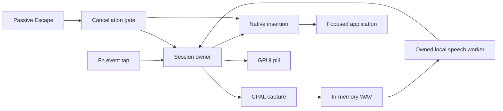

# Architecture

Speakeasy is a Rust dictation app for Apple silicon Macs. GPUI renders Settings and one
non-activating dictation pill. A session owner coordinates the Fn event tap, Core Audio capture
through CPAL, a local speech worker, and insertion into the focused application.



## Modules

| Area                                                            | Responsibility                                                                                                                                                    |
| --------------------------------------------------------------- | ----------------------------------------------------------------------------------------------------------------------------------------------------------------- |
| `crates/core`                                                   | Pure gesture deadlines and analytic motion springs.                                                                                                               |
| `crates/platform`                                               | The Fn event tap, lifecycle notifications, pill window configuration, insertion, reduced-motion preference, the speech engine's C ABI, and owned process groups.  |
| `crates/dictation`                                              | The GPUI-free service: session owner, capture, recognition worker, settings, setup, instance ownership, status, themes, and the shell's lifecycle and save queue. |
| `dictation/src/runtime/`                                        | One session owner; recording, inference, cancellation, settings changes, and final insertion ordering.                                                            |
| `runtime/session.rs`, `microphone.rs`, `worker.rs`              | Session authority and presentation stages; one open or retiring microphone; one ready worker or owned load/inference/recovery job.                                |
| `crates/platform/src/keyboard.rs`, `monitor.rs`, `insertion.rs` | Portable Fn decisions, stop coordination for the tap's run loop, and insertion eligibility; the native adapter collects facts and submits effects.                |
| `dictation/src/audio.rs`, `audio/control.rs`                    | CPAL capture, typed callback control, bounded ring, audio levels, speech gate, quiet-edge trimming, and five-minute recording limit.                              |
| `dictation/src/local_speech.rs` and `local_speech/`             | The warm engine process: the Parakeet helper over pipes, or an engine's HTTP server; bounded replies and cancellation recovery.                                   |
| `dictation/src/transcript.rs`                                  | Linear transcript whitespace and filler cleanup before insertion. |
| `dictation/src/ports.rs`                                        | Capture, speech, and insertion interfaces used by the session owner and unattended fixtures.                                                                      |
| `dictation/src/setup.rs`                                        | Automatic setup: the Metal engine build checked by its own doctor, pinned resumable downloads, and extraction.                                                    |
| `dictation/src/{lifecycle,save}.rs`                             | Service ownership across enable, pause, and quit, and ordered durable settings writes.                                                                            |
| `dictation/src/instance.rs`                                     | Configuration-directory lock and an owned loopback listener for Reveal, Toggle, and Cancel commands from later launches.                                          |
| `dictation/src/config.rs`, `status.rs`, `theme.rs`              | Typed settings with validation and atomic saves, shared readiness status, and the four color themes.                                                              |
| `crates/app/src/pill.rs` and `pill/`                            | Grille pill, measured audio envelope, and frame-driven motion.                                                                                                    |
| `crates/app/src/shell.rs` and `shell/`                          | Settings, service wiring, pause, and coordinated shutdown.                                                                                                        |
| `crates/app/src/tray.rs` and `tray/`                            | Owned menu bar item, template icon, menu actions, and snapshot-driven status updates.                                                                             |
| `crates/app/src/gpui_ext.rs`, `icons.rs`                        | GPUI updates that become no-ops once their target is gone, native window handles, theme fills, and embedded Settings icons.                                       |

Core, dictation, and the app forbid unsafe code; platform contains native FFI with local safety
explanations. The GPUI-free crates build and test on any Unix host, so the session owner's tests run
without a Mac; the app builds only on macOS. Tests live beside their modules; dependency regression
fixtures under `crates/app/tests` include the patched helpers directly.

The root Cargo patch selects a narrowly patched GPUI 0.2.2 source under `vendor/gpui`, outside the
workspace. Its native handle, visibility, queued-event, timing, frame-source lifetime, and
rendering-resource contracts are documented in
[the dependency patch](../vendor/gpui/README.speakeasy.md). Unmodified upstream files and the
license are preserved; regression checks cover the patched behavior.

## Session ownership

Capture starts on the first Fn press. Hold/release finishes a recording; Space during the hold or a
double-tap enables hands-free capture, and another press finishes it. A short single tap finishes
after the double-tap window. Escape passes to the focused app and invalidates the insertion gate
immediately. The five-minute cap is independent of UI animation.

Capture owns its microphone thread. Finishing and cancellation retire it asynchronously; a retry
waits for device teardown before opening another capture. Shortcut monitoring initializes off the UI
thread and reports desktop readiness through the session's input channel. Pause starts microphone,
speech, and shortcut cleanup together and waits for their owned completion. The shell retains the
native monitor, whose event tap lives on its own run-loop thread, through retirement.
Application-owned Quit requests enter a terminal lifecycle state, stop services and setup, drain
requested saves, and await cleanup while rendering continues. Repeated Quit requests are harmless,
and delayed validation/save/setup completion cannot re-enable dictation. The instance lock is
released after Settings writers. Cleanup waits without a time limit for audio-driver teardown,
process reaping, insertion, setup, and saves. A stuck owner leaves Quitting visible while the UI
remains responsive. Native forced termination still uses synchronous disposal as a fallback.

`runtime/mod.rs` exposes start, configure, stop, and completion acknowledgement. `owner.rs` receives
one wake, handles it, advances ready work, and publishes a snapshot. Its decisions use owned state;
snapshots are presentation only. `Session` owns a generation-bound permit and its current stage.
`Microphone` is `Free`, `Open`, or `Retiring`, so opening cannot replace an unreaped device.
`Worker` is unavailable, loading (including recovery after a cancelled transcription), ready, or
transcribing; load and transcription jobs have different result types. Replacement consumes the old
job and reaps its process before loading another. Stopping capture during a failed warmup retains
the gesture and device until audio completion; the next on-demand load can retry without a warmup
retry loop.

Capture callbacks carry a typed `SessionId`. One lookup checks both identity and capture stage.
Moving inference or insertion handles out of the observation path makes their obsolete results
unable to change the current session. Cancellation revokes the permit before waiting for cleanup.
Callback atomics control capture and cancellation; other state changes arrive as messages. The UI
receives coalesced snapshots and never reads PCM. A lifecycle epoch captured before thread startup
prevents an old publisher from replacing a newer shell pause/quit notice.

```mermaid
stateDiagram-v2
    [*] --> Queued
    Queued --> Opening: microphone free
    Opening --> Recording: first samples
    Opening --> Stopping: finish requested
    Recording --> Stopping: release / next press / limit
    Stopping --> AwaitingWorker: audio complete; retire microphone
    AwaitingWorker --> Transcribing: worker ready
    Transcribing --> Inserting: nonempty text
    Inserting --> [*]: submitted / copied / cancelled
    Recording --> [*]: cancel; revoke permit and retire
    Transcribing --> [*]: cancel; revoke permit and recover worker
```



The shell lifecycle owns one runtime/monitor pair: disabled, validating, running, stopping with an
optional latest configuration, or quitting. Retiring owners remain retained until both acknowledge.
A second pause discards a pending resume; quitting is terminal. Validation epochs also protect
delayed saves from resuming an intentionally paused app. Snapshots distinguish model readiness from
capture state, and empty recognition from submitted input. Only native input submission produces the
completion check. View-owned feedback timers redraw the current snapshot; they cannot publish
session changes. A weak view callback checks animation deadlines on native frames within the
[frame budget](performance.md#implementation-constraints), without a repeating timer. Meter updates
coalesce into the pending frame; session changes redraw immediately. Native visibility work resolves
the latest pill state before showing or hiding it, so a queued dismissal cannot hide a later
recording.

Settings stays alive when hidden, preserving unsaved edits; minimize keeps normal Dock behavior.
Native show/hide runs outside GPUI borrows. Menu bar tasks are cancelled before session services are
retired at quit. Settings validation and durable saves run off the UI thread. Saves serialize the
requested drafts, coalescing queued requests to the latest one. Completion preserves edits made
after Save, and Pause invalidates a pending enable request. Quit waits for requested writes. Resume
validates configured files in the background before enabling dictation.

Relaunch discovery uses `instance.port` next to the locked `instance.lock`. The loopback listener
accepts fixed Reveal, Toggle, and Cancel commands, returns a fixed identification response, and
carries no audio or transcript data. `speakeasy --toggle` and `--cancel` send the latter two. Its
thread sleeps in accept, is explicitly woken and joined at shutdown, and holds the lock until
cleanup finishes. The first-hide hint is remembered in `tray-hint-seen` beside settings without
rewriting the user's configuration.

The audio callback writes to a bounded ring without allocating. The speech meter spans −60 to −6
dBFS; its top is a speech reference, not a clipping indication. Unencoded PCM is zeroed whenever its
buffer drops, and a captured WAV awaiting a worker is zeroed if its session ends; neither erases
copies in the ring, allocator, HTTP client, or engine. A consumer owns mono PCM at the device's
sample rate, begins with a ten-second reservation, and grows only up to the recording limit. A
native discontinuity before the first sample is queued does not abort startup. After that, a
discontinuity fails the recording rather than silently transcribing potentially incomplete speech.
Refused real-time priority and automatic route changes keep the stream active. Fatal stream errors
return through a bounded, nonblocking channel with their driver details, while a full application
ring has a separate error. The consumer drains the ring every 5 ms until the first samples arrive,
then every 16 ms; Finish and Cancel wake it at once. It classifies each 20 ms window as audible or
quiet once, as audio arrives. After stopping, it requires 100 ms of audible windows, trims leading
quiet of at least one second and trailing quiet beyond 500 ms of padding, and preserves interior
pauses. WAV preparation stays off the UI. The native acceptance procedure is in
[performance](performance.md#native-acceptance). Heavily trimmed recordings release excess PCM
capacity when at least 8 MiB is unused and capacity is at least four times the remaining length.

Hands-free recordings speculate. Once new speech has been followed by 500 ms of quiet, the consumer
copies the audio a recording stopped at that moment would keep and reports it as a numbered pause;
the owner recognizes the latest pause whenever the warm worker is idle, never loading one for it.
Because the same window classification trims both, the finished recording's audio is byte-for-byte
the latest pause's exactly when their kept ranges match, and the capture names that pause. The owner
then inserts the pause's text, or waits for its running recognition, instead of requesting another.
Speech after a pause moves the range, so that pause's text is discarded and the recording makes its
own request, waiting behind any running speculation. A failed or cancelled speculation sends an
identical recording to its own request. Held recordings never speculate: the shortcut's release
follows the last word too closely to benefit, and a speculation could delay the final request.

## Setup

A fresh install opens Settings and starts setup; later launches offer it only while no engine is
configured. Setup owns its thread and runtime. Cancel signals it immediately and retains it until
cleanup acknowledges; Quit joins active and retiring setup work. A machine-local `setup.lock`
serializes directory writes across retries and app instances. Cancellation terminates and waits for
the owned extraction or doctor process before releasing that lock; partial downloads remain
available to resume. Setup installs NeMo-Speech.cpp's Metal build and uses the GPU when the engine's
`doctor` command confirms that its accelerator works.

Downloads use pinned GitHub release and Hugging Face revision URLs. Each is written beside its
destination as a `.part` file, resumed with an HTTP range request, and renamed into place only after
its size and SHA-256 match. A complete partial file is verified locally without another download.
Resumed data is hashed in bounded chunks with cancellation opportunities between reads. The system
`tar` unpacks the engine archive into a staging directory that is then renamed, and unused builds
are removed. The result is saved like a manual choice and enables dictation.

## Local recognition

The configured `engine_executable` and model select one explicitly chosen engine: Parakeet, on the
GPU or CPU, or Whisper. Worker output and transcripts are not retained in diagnostic logs.

Parakeet runs in a helper: this executable re-run with `--speech-helper`, which loads the configured
installation's `lib/libnemo_speech_asr_c.1.dylib` and the model through the engine's stable C ABI,
never starting AppKit. One parent task owns the helper's pipes. It writes each recording's PCM16
samples behind an eight-byte rate and length header and reads back a status byte and UTF-8 text, so
the reply to an abandoned request is read and discarded rather than mistaken for the next one. The
helper scales samples by 1/32768 exactly as the engine's WAV reader does, so it sees the same input
as the HTTP route. It answers on a private copy of standard output, with descriptor 1 redirected to
standard error, so a library that prints cannot corrupt a reply. Closing its standard input, as the
parent's death does, ends the helper at once even during inference. Whisper, and a Parakeet
installation without the C library, run the engine's own HTTP server; audio is posted from memory on
loopback, through a client without proxies or redirects.

Model loading starts in the background. GPU preference adds a silent warmup request before
readiness. Whisper language travels with each request, so a
language change does not reload the model. Whisper uses full context and default timestamp decoding.

The transcription job runs `transcript::for_insertion` for either engine before publishing its
result. Engine segment whitespace becomes single spaces, never Enter presses. With `remove_fillers`
enabled (the default), whitespace-delimited “um” and “uh” tokens are removed without case
sensitivity, including adjacent pause punctuation; compounds, identifiers, and individually quoted
tokens stay literal. Whisper only removes fillers for explicit English requests; other languages and
`auto` preserve literal words. Parakeet auto-detects without returning language metadata, so its
cleanup switch expresses the user's English preference; disable it for other languages. Request-time
preferences travel with the transcription job and do not reload the model. Cleanup removes a
preceding filler comma and preserves sentence endings after content. Filler-only results follow the
empty-recognition path without insertion. Cleanup takes linear time and one output allocation,
without token collections, regular expressions, another model, or a background service.

GPU cancellation drops the request and checks recovery with a bounded silent inference. A failed
two-second recovery terminates and waits for the worker before replacement. Cancellation of active
CPU inference terminates the worker and reloads it. The engine's process group is cleaned up during
orderly shutdown; a force-quit can leave a worker running. Pause retires the runtime asynchronously;
Quit waits for owned cleanup. A failed warmup does not retry-loop. Startup errors report the exit
status and a local remedy for unsupported CPU instructions or incompatible server arguments. Engine
stderr remains discarded because it can include private text; diagnostic messages never forward
engine output. Model startup and inference receive cooperative cancellation. Retirement waits for
process exit before loading a replacement, while the session owner continues receiving input.

## Insertion and privacy

Insertion is asynchronous and owns a generation-bound commit permit. Native preparation cannot block
the session owner or authorize a newer recording. Only the currently owned completion can update the
session; shutdown awaits obsolete insertion cleanup.

Insertion waits briefly for physical modifiers to be released. Normal mode writes text to the
clipboard and submits Command-V; the pasteboard change count preserves newer copies. If automatic
paste cannot proceed after copying, Settings explains how to paste manually. Target focus takes
precedence over held modifiers.

**Keep clipboard** uses native Unicode input and leaves the clipboard untouched. All text validation
precedes the single permit commit. After commit, a native failure reports a partial/unavailable
submission or manual-paste outcome and is never automatically repeated. Both paths check
cancellation before committing native input. Submission cannot prove that an editor accepted the
text, and Escape cannot retract input already submitted to the OS.

There are no accounts, cloud providers, transcript history, or telemetry. Capture begins only when
dictation is triggered.

## Verification

`mise run standards:check` is the local and CI gate; CI runs it on a macOS runner with the owned
window rendering check and packaging. On another Unix host, these commands type-check the GPUI-free
crates for Apple silicon and run their tests; neither verifies native runtime behavior or builds the
GPUI application:

```sh
cargo clippy -p speakeasy-core -p speakeasy-platform -p speakeasy-dictation --all-targets \
  --locked --target aarch64-apple-darwin -- -D warnings
cargo nextest run -p speakeasy-core -p speakeasy-platform -p speakeasy-dictation --locked
```

Default checks use fake capture and insertion. Public-audio fixtures exercise the real session owner
and local worker; `--demo` uses the actual views with scripted levels and no microphone, global
hook, or insertion. Native microphone/editor acceptance requires explicit opt-in and is reported
separately. Build commands are in the [README](../README.md); profiling methods and remaining
performance gaps are in [performance](performance.md).

### Change and test map

| Change                                          | Read first                                                     | Relevant default checks                                                                                            |
| ----------------------------------------------- | -------------------------------------------------------------- | ------------------------------------------------------------------------------------------------------------------ |
| Gestures, deadlines, startup, cancellation      | `runtime/owner.rs`, `session.rs`, `microphone.rs`, `worker.rs` | `runtime/tests.rs` drives the production owner; paused Tokio time tests the same deadlines used in production.     |
| Device errors, callback limits, PCM preparation | `audio.rs`, `audio/control.rs`, `ports.rs`                     | Synthetic samples check callback budgets, cancellation, checked WAV encoding, and controlled thread teardown.      |
| Pause, reconfigure, quit, delayed saves         | `shell/services.rs`, `lifecycle.rs`, `shutdown.rs`, `save.rs`  | Lifecycle and save tests check terminal quit, latest pending configuration, ordered writes, and later edits/Pause. |
| Keyboard policy                                 | `platform/keyboard.rs`, `platform/macos.rs`                    | Pure key decisions run on every host; the native event tap requires opt-in.                                        |
| Insertion                                       | `platform/insertion.rs`, `InsertPermit`, `platform/macos.rs`   | Eligibility, cancellation/commit, and partial key submission.                                                      |
| Engine startup/recovery                         | `local_speech/`, `runtime/worker.rs`, `platform/speech.rs`     | Helper framing, ordering, and failures over in-memory pipes; server exit/cancellation; the C ABI's struct layouts. |
| Dependency patches                              | Each vendor `README.speakeasy.md`                              | Portable GPUI fixtures plus the macOS rendering check.                                                             |
| Profiling and packaging                         | `scripts/profile_macos.py`, `scripts/package-macos.sh`         | Public `ps`/`vmmap` fixtures under an explicit clock.                                                              |

Live microphone, the event tap, clipboard/editor acceptance, and mixed-display frame pacing require
explicit native acceptance.

Use explicit gates for fake cleanup, closing them when a failed test disposes its harness. Timer
timeouts inside fakes change paused-time behavior; use bounded observation helpers instead. Add a
port only for an actual side effect. Keep native mechanics in the adapter and deterministic
decisions in portable code.
