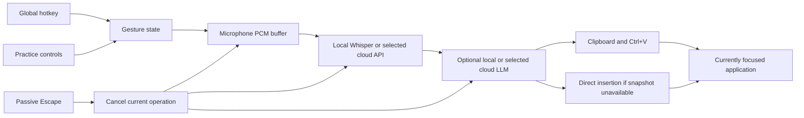

# .NET architecture

For the Rust implementation, see the [Rust module map](rust-rewrite-plan.md).

Speakeasy is a per-user Windows tray application. A .NET 10 WinForms process owns keyboard input, recording, the floating pill, and insertion. Speech recognition and text cleanup are selected explicitly through configuration; the ordinary local path uses owned native processes that keep their models loaded.

## Components

| Area | Responsibility |
| --- | --- |
| `Speakeasy.Core/Interaction` | Pure hold/tap/hands-free transitions with a monotonic clock and five-minute ceiling. |
| `Speakeasy.Core/Configuration` | Validated settings, atomic JSON saves, and `.env` resolution without changing global environment variables. |
| `Speakeasy.Core/Transcription` | Local/cloud speech recognition, LLM cleanup, deadlines, process ownership, and provider error handling. |
| `Speakeasy.App/Platform` | Windows key hook, NAudio capture, PCM bounds, clipboard snapshots, and `SendInput`. |
| `Speakeasy.App/DictationController` | Coordinates one current recording or operation and rejects stale asynchronous completions. |
| `Speakeasy.App/UI` | Dashboard, preferences, practice scratchpad, microphone check, and a non-activating recording pill. |
| `Speakeasy.App/TrayApplicationContext` | Tray lifecycle, settings reload, asynchronous model warmup, login preference, and power/session cancellation. |

Core has no Windows UI dependency. The platform adapters implement narrow recording and insertion interfaces, so lifecycle tests do not need to open a microphone, install a global hook, or touch the user's clipboard.

## Input and recording

The low-level keyboard hook runs on a dedicated message-loop thread. It tracks key transitions, accepts external injected input such as Sunshine's remote keyboard events, filters auto-repeat, and forwards logical shortcut events to the UI thread. Speakeasy stamps its own paste keystrokes and excludes those events from shortcut handling. It suppresses the configured activation key while handling the shortcut. Escape is observed and passed onward.

`DictationGesture` distinguishes `Idle`, `Held`, `PendingTap`, `HandsFree`, and `Processing`. Capture starts on the first press. A release within `tapMaxMs` leaves capture active through `doubleTapMs`; a second press in that interval changes to hands-free. Expiration wins over a second tap arriving at the deadline. An ordinary held release or another press during hands-free stops capture. A still-held physical key must be released before cancellation/completion can permit another session.

Capture uses 16 kHz, mono, signed 16-bit PCM. Audio stays in memory while recording. The recorder uses both a five-minute sample cap and a wall-clock stop timer independently of the UI timer; the gesture layer enforces the same upper bound. The recorder computes the level for the pill and applies a configurable silence threshold before sending audio for transcription.

Before producing the WAV, the PCM buffer checks 20 ms energy windows at each edge. Quiet edges lasting at least one second are shortened while retaining 500 ms of padding for quiet word boundaries. Every interior pause remains unchanged. Trimming requires both the existing speech-energy gate and an audible window; the captured length and hard cap stay unchanged, while WAV headers and returned duration describe the trimmed audio. The pill's elapsed time comes from the gesture clock.

Driver stop calls run on queued work with bounded retries while awaiting acknowledgement. A separate native-device lock serializes stop and disposal without holding the session-state lock during those calls. Cancellation can detach the active session and clear its PCM immediately even if a driver is slow to stop; recording callbacks do not depend on the UI message loop for cleanup.

The **Try dictation** window provides a temporary editable scratchpad. Its Start and Finish controls use the same hands-free gesture, recorder, providers, and clipboard insertion path as the global shortcut. They return focus to the scratchpad before insertion, preserve its selection, and apply the normal clipboard settings. Closing the window cancels current work and discards the practice text. Preferences also provides **Check microphone**, a ten-second local level check using the selected input; it always discards captured audio without transcription or insertion.

Capture uses a Windows recording endpoint on the host. Moonlight keyboard
delivery and client microphone delivery are independent paths; a remote
microphone needs an audio bridge that exposes its signal through such an
endpoint. See [remote dictation](remote-dictation.md) for routing.

## Operation ownership and cancellation

The controller serializes state changes on the UI thread. Each asynchronous finish operation captures a generation number and a cancellation source. Before updating state or inserting text, it verifies that it still owns the current generation. A late callback from a cancelled session cannot paste over a newer one.

Escape, disabling dictation, settings reload, session lock/disconnect, suspend, and shutdown cancel the appropriate owned work. Network calls and subprocess waits receive cancellation tokens. Cleanup failures may return the raw transcript with a notice; cancellation propagates and does not take that fallback path.

Transcription and cleanup have independent configured deadlines. Clipboard restoration after an already-sent paste is cleanup work: it may finish after cancellation so the saved clipboard is not abandoned. Cancellation cannot undo keystrokes that Windows has already delivered.

## Local inference

In server mode, `LocalWhisperHost` starts a hidden whisper.cpp server on an ephemeral `127.0.0.1` port with an unpredictable request-path prefix and an empty public directory. Readiness is checked before inference. A semaphore serializes startup and inference. Model files remain loaded across recordings; startup happens asynchronously without opening the microphone.

WAV bytes are posted directly from memory to the owned `/inference` endpoint. Conversion through ffmpeg is disabled. The server uses isolated dictation context and returns JSON text. Its stdout and stderr are drained without retaining logs or transcripts. The implementation follows the native [whisper.cpp server interface](https://github.com/ggml-org/whisper.cpp/blob/master/examples/server/README.md).

Cancellation captures the worker generation handling that request and terminates its process tree. It never looks up a process by executable name. A later request can start a new generation; an older cancellation callback cannot terminate it. Disposal terminates the owned workers.

CLI mode starts whisper.cpp for each recording through `ProcessStartInfo.ArgumentList`, without a shell. Each invocation receives a unique temporary directory under the user's local application data. WAV input and text output are deleted in `finally`; the process is killed on cancellation or timeout, and both output streams are drained asynchronously. CLI invocation follows the [whisper.cpp CLI interface](https://github.com/ggml-org/whisper.cpp/blob/master/examples/cli/README.md). The CLI fallback is used when the configured server executable is missing, never as a route to a cloud provider.

For owned local cleanup, `LocalCleanupHost` starts llama.cpp on its own ephemeral loopback port and holds the configured GGUF model in memory. Its lease supplies the endpoint and an abort action bound to that exact worker. The pipeline also supports an existing local OpenAI-compatible server; it does not own or terminate that external server.

## Providers and data handling

The speech provider flag selects `local`, `groq`, or `openai`. Cloud speech uses multipart WAV uploads and explicit model IDs. HTTP clients are reused, requests have deadlines, and redirects are disabled. Local inference and health checks use dedicated clients with proxy use disabled, so loopback requests cannot be routed through a configured system or environment proxy. Cloud requests use a separate client and HTTPS endpoints. User-configurable local cleanup endpoints must resolve syntactically to loopback HTTP/HTTPS URLs without embedded credentials, query strings, or fragments.

`.env` accepts plain or quoted `NAME=value` entries and comments; it does not evaluate shell commands or expand variables. Process environment values take precedence. Configuration reload constructs a new pipeline with a settings/key snapshot, preventing provider changes during a session. API errors report a safe status and next step without echoing provider bodies, keys, or dictated text.

Cleanup sends the transcript in a JSON dictation field beneath a short editing instruction and examples. It asks the LLM to preserve meaning, names and signoffs, remove fillers, punctuate, apply spoken formatting and self-corrections, match the selected casing style, and treat dictated instructions as text. Empty or malformed output, a reported `finish_reason` other than `stop`, or excessive expansion falls back to the original transcript with a notice. The prompt is an editing constraint, not a guarantee that a language model cannot make a mistake.

The default `cleanup.provider: auto` stays offline with local speech and chooses no LLM cleanup. Installing local cleanup explicitly selects the local model. With cloud speech, `auto` uses the same selected provider. Merely finding a key never enables a cloud path.

Ordinary sessions have no transcript archive or telemetry. The explicit `--transcribe-file` diagnostic writes the transcript and timings only to the user-requested result file. Model installation downloads binaries and weights; it is separate from runtime dictation.

## Insertion and clipboard ownership

Insertion runs on the STA UI thread and never brings a destination window forward. The normal path waits briefly for physical modifier keys to be released, writes Unicode text to the clipboard, then sends Ctrl+V to the current foreground window. The floating pill does not activate. Delivered input is the success criterion; Windows does not provide a universal acknowledgement that a target accepted the text.

With restoration enabled, Speakeasy first tries to materialize every previous clipboard format before replacement, including native retrieval for opaque formats that have no managed representation. It checks the clipboard sequence number before insertion and again under the clipboard lock before restoration. A new copy from another app is preserved. Native clipboard ownership uses a hidden window, and temporary format handles have explicit lifetimes.

If a complete, stable snapshot cannot be obtained, direct insertion leaves the entire clipboard untouched. For a recognized Unicode Edit or RichEdit control, including WinForms variants, it replaces the current selection through undoable `EM_REPLACESEL` with CRLF line breaks. Focus, menu state, modifier keys, disabled/read-only state, and target elevation are checked before delivery. The message uses a 250 ms timeout; an uncertain result is reported without retrying through another method, because insertion may already have happened.

Other control classes receive marked Unicode input packets one scalar at a time, keeping surrogate pairs together and pausing five milliseconds between scalars. Line breaks become Unicode carriage returns; no `VK_RETURN` keystroke is emitted. Cancellation, foreground-window identity, and modifier keys are checked before each scalar. This path is best effort because controls differ in their handling of Unicode packets and newlines. A focus change or blocked input stops the remaining text; already delivered input cannot be undone.

When the normal clipboard path is blocked by an elevated target, held modifiers, or rejected input, the transcript remains on the clipboard for manual paste. Direct insertion instead preserves the previous clipboard and reports why insertion stopped. Custom formats and slow consumers impose practical limits described in the [README](../README.md#clipboard-behavior).

## Verification

Tests cover gesture timing, delayed callbacks, cancellation, fixed audio bounds and conservative edge trimming, hook filtering, clipboard ownership, provider serialization/parsing, and termination of an owned subprocess tree. Default repeatable tests use fakes for live audio and insertion. Explicitly authorized interactive acceptance uses a real editable field or the practice scratchpad and the selected Windows recording endpoint; the microphone check verifies input routing independently. The file-only diagnostic measures model warmup and repeated inference without recording live audio or changing focus/clipboard.

Build and test commands are in the [README](../README.md#build-package-and-verify). Repository conventions are documented in the scoped [standards adoption](standards.md).
