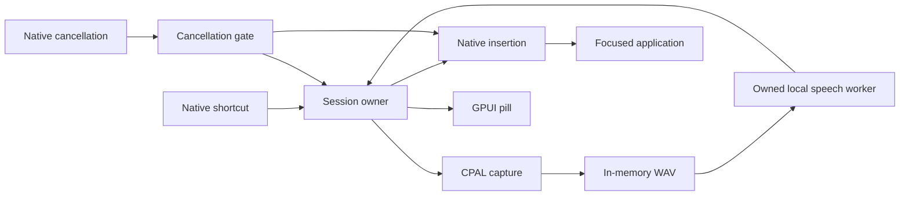

```mermaid
stateDiagram-v2
    [*] --> Queued
    Queued --> Opening: microphone free
    Opening --> Recording: first samples
    Opening --> Stopping: finish requested
    Recording --> Stopping: release / next press / limit
    Stopping --> AwaitingWorker: audio complete; retire microphone
    AwaitingWorker --> Transcribing: worker ready
    Transcribing --> Inserting: nonempty text
    Inserting --> [*]: submitted / copied / cancelled
    Recording --> [*]: cancel; revoke permit and retire
    Transcribing --> [*]: cancel; revoke permit and recover worker
```

# Architecture

Speakeasy is a Rust desktop app for Windows, macOS, and Linux. GPUI renders
Settings and one non-activating dictation pill. A session owner coordinates native input,
CPAL capture, a local speech worker, and insertion into the focused application.
Linux has experimental X11/Wayland desktop support; native desktop acceptance
is pending. [Linux implementation](linux-implementation.md) records its support
limits and remaining checks.

## Modules

| Area | Responsibility |
| --- | --- |
| `crates/core` | Pure gesture deadlines and analytic motion springs. |
| `crates/platform` | Native keyboard input, lifecycle notifications, pill windows, the Windows file dialog, insertion, reduced-motion preference, and owned process containment. |
| `crates/app/src/runtime/` | One session owner; recording, inference, cancellation, settings changes, and final insertion ordering. |
| `runtime/session.rs`, `microphone.rs`, `worker.rs` | Session authority and presentation stages; one open or retiring microphone; one ready worker or owned load/inference/recovery job. |
| `crates/platform/src/keyboard.rs`, `insertion.rs` | Portable keyboard decisions and shared insertion eligibility; native adapters collect facts and submit effects. |
| `crates/app/src/audio.rs` | CPAL capture, bounded callback ring, audio levels, speech gate, quiet-edge trimming, and five-minute recording limit. |
| `crates/app/src/local_speech.rs` | Warm Whisper or Parakeet process, loopback HTTP, bounded responses, and cancellation recovery. |
| `crates/app/src/ports.rs` | Capture, speech, and insertion interfaces used by the session owner and unattended fixtures. |
| `crates/app/src/pill.rs` | Grille pill, measured audio envelope, and frame-driven motion. |
| `crates/app/src/setup.rs` | Automatic setup: engine choice through NeMo's doctor, pinned resumable downloads, and extraction. |
| `crates/app/src/shell.rs` and `shell/` | Settings, ordered durable saves, service lifecycle, pause, and coordinated shutdown. |
| `crates/app/src/tray.rs` | Owned native tray icon, menu actions, and snapshot-driven status updates. |
| `crates/app/src/status.rs` | Shared readiness and capture status for Settings and the tray. |
| `crates/app/src/theme.rs` | Selectable color themes shared by Settings, the pill, and the tray. |
| `crates/app/src/icons.rs` | Embedded Settings icon assets for GPUI's existing SVG atlas. |
| `crates/app/src/instance.rs` | Configuration-directory lock and an owned loopback listener for revealing the existing Settings window. |
| `crates/app/src/config.rs` | Typed settings, path resolution, validation, and atomic saves. |

Core and app forbid unsafe code. Platform contains native FFI with local safety
explanations. Application tests live beside their modules; dependency regression
fixtures under `crates/app/tests` include the patched helpers directly.

The root Cargo patch selects a narrowly patched GPUI 0.2.2 source under
`vendor/gpui`, outside the workspace. Its native handle, visibility, queued-event,
timing, frame-source lifetime, and rendering-resource contracts are documented in
[the dependency patch](../vendor/gpui/README.speakeasy.md). Unmodified upstream
files and the license are preserved; regression checks cover the patched behavior.

## Session ownership

Capture starts on the first shortcut press. Hold/release finishes a recording;
Space during the hold on Windows/macOS or a double-tap enables hands-free capture,
and another press finishes it. A short single tap finishes after the double-tap
window. Windows/macOS Escape passes to the focused app; Linux uses a reserved
cancel chord or explicit desktop command. Both invalidate the insertion gate
immediately. The five-minute cap is independent of UI animation.

Capture owns its microphone thread. Finishing and cancellation retire it
asynchronously; a retry waits for device teardown before opening another capture.
Shortcut monitoring initializes off the UI thread on every platform and reports
desktop readiness through the session's input channel. Pause starts microphone,
speech, and shortcut cleanup together and waits for their owned completion.
The shell retains thread-affine native monitors on the UI thread through retirement.
Application-owned Quit requests enter a terminal lifecycle state, stop services
and setup, drain requested saves, and await cleanup while rendering continues.
Repeated Quit requests are harmless, and delayed validation/save/setup completion
cannot re-enable dictation. The instance lock is released after Settings writers.
Cleanup waits without a time limit for audio-driver teardown, process reaping,
insertion, setup, and saves. A stuck owner leaves Quitting visible while the UI
remains responsive. Native forced termination still uses synchronous disposal
as a fallback; its responsiveness
requires native acceptance before changing GPUI termination handling.

`runtime/mod.rs` exposes start, configure, stop, and completion acknowledgement.
`owner.rs` receives one wake, handles it, advances ready work, and publishes a
snapshot. Its decisions use owned state; snapshots are presentation only.
`Session` owns a generation-bound permit and its current stage. `Microphone`
is `Free`, `Open`, or `Retiring`, so opening cannot replace an unreaped device.
`Worker` is unavailable, loading, ready, transcribing, or recovering; load and
transcription jobs have different result types. Replacement consumes the old
job and reaps its process before loading another. Stopping capture during a
failed warmup retains the gesture and device until audio completion; the next
on-demand load can retry without a warmup retry loop.

Capture callbacks carry a typed `SessionId`. One lookup checks both identity and
capture stage. Moving inference or insertion handles out of the observation path
makes their obsolete results unable to change the current session. Cancellation
revokes the permit before waiting for cleanup. Callback atomics control capture
and cancellation; other state changes arrive as messages. The UI receives
coalesced snapshots and never reads PCM. A lifecycle epoch captured before thread
startup prevents an old publisher from replacing a newer shell pause/quit notice.

The shell lifecycle owns one runtime/monitor pair: disabled, validating, running,
stopping with an optional latest configuration, or quitting. Retiring owners
remain retained until both acknowledge. A second pause discards a pending resume;
quitting is terminal. Validation epochs also protect delayed saves from resuming
an intentionally paused app.
Snapshots distinguish model readiness from capture state, and empty recognition
from submitted input. Only native input submission produces the completion check.
View-owned feedback timers redraw the current snapshot; they cannot publish
session changes. A weak view callback checks animation deadlines on native
frames, budgeting 200 redraws per second without a repeating timer. Meter
updates coalesce into the pending frame; session changes redraw immediately.
Native visibility work resolves the latest pill state before showing or hiding
it, so a queued dismissal cannot hide a later recording.

Settings stays alive when hidden, preserving unsaved edits. On Windows, file
choices use a native Open dialog on its own thread; shown from GPUI's UI thread,
the dialog stays unpainted while GPUI is idle. Windows intercepts
the native minimize command with a window-owned subclass and enqueues a hide;
macOS retains its normal minimize behavior. Native show/hide runs outside GPUI
borrows. The Windows pill consumes hidden paint messages with a native paint
cycle; merely validating its region can leave paint pending and spin the message
loop. Visible paint reaches GPUI. Tray tasks are cancelled before session
services are retired at quit.

Settings validation and durable saves run off the UI thread. Saves serialize the
requested drafts, coalescing queued requests to the latest one. Completion
preserves edits made after Save, and Pause invalidates a pending enable request.
Quit waits for requested writes. Resume validates configured files in the
background before enabling dictation.

Relaunch discovery uses `instance.port` next to the locked `instance.lock`.
The loopback listener accepts fixed Reveal, Toggle, and Cancel commands, returns
a fixed identification response, and carries no audio or transcript data. Linux
exposes Toggle/Cancel only when desktop command bindings are enabled. Its thread
sleeps in accept, is explicitly woken and joined at shutdown, and holds the lock
until cleanup finishes. The first-hide hint is remembered in `tray-hint-seen`
beside settings without rewriting the user's configuration.

The audio callback writes to a bounded ring without allocating. The speech meter
spans −60 to −6 dBFS; its top is a speech reference, not a clipping indication.
Cancellation, errors, and rejected silence best-effort clear the owned PCM buffer;
this does not guarantee erasure of copies in the ring, allocator, HTTP, or engine. A consumer owns
mono PCM at the device's sample rate, begins with a ten-second reservation, and
grows only up to the recording limit. A native discontinuity before the first
sample is queued does not abort startup. After that, a discontinuity fails the
recording rather than silently transcribing potentially incomplete speech.
Refused real-time priority and automatic route changes keep the stream active.
Fatal stream errors return through a bounded, nonblocking channel with their
driver details, while a full application ring has a separate error. After stopping,
it requires 100 ms of audible 20 ms windows, trims quiet edges of at least one
second while retaining 500 ms padding, and preserves interior pauses. WAV
preparation stays off the UI. Native measurements under gaming load are in
[performance](performance.md#native-capture-with-valorant).
Heavily trimmed recordings release excess PCM capacity when at least 8 MiB is
unused and capacity is at least four times the remaining length.

## Setup

A fresh install opens Settings and starts setup; later launches offer it only
while no engine is configured. Setup owns its thread and runtime. Cancel signals
it immediately and retains it until cleanup acknowledges; Quit joins active and
retiring setup work. A machine-local `setup.lock` serializes directory
writes across retries and app instances. Cancellation terminates and waits for
the owned extraction or doctor process before releasing that lock; partial
downloads remain available to resume. It chooses a NeMo-Speech.cpp build by asking
each candidate's `doctor` command whether its accelerator works: CUDA when an NVIDIA
driver is present, then Vulkan with a discrete GPU of at least 6 GB, then the
CPU. Apple silicon uses Metal.

Downloads use pinned GitHub release and Hugging Face revision URLs. Each is
written beside its destination as a `.part` file, resumed with an HTTP range
request, and renamed into place only after its size and SHA-256 match. A
complete partial file is verified locally without another download. Resumed
data is hashed in bounded chunks with cancellation opportunities between reads.
The system `tar` unpacks engine archives into a staging directory that is then
renamed, and unused builds are removed. The result is saved like a manual
choice and enables dictation.

## Local recognition

The configured `engine_executable` and model select one explicitly chosen engine:
Parakeet, on the GPU or CPU, or Whisper. These are external native inference
processes; the desktop application is Rust. Audio is posted from memory to the
owned worker on loopback, through a client without proxies or redirects. Worker
output and transcripts are not retained in diagnostic logs.

Model loading starts in the background. GPU preference adds a silent warmup
request before readiness. Linux CPU workers also validate one synthetic inference
before readiness, because model loading alone cannot establish CPU compatibility.
Whisper language travels with each request, so a
language change does not reload the model. Whisper uses full context and default
timestamp decoding; returned segment whitespace is normalized before insertion.

GPU cancellation drops the request and checks recovery with a bounded silent
inference. A failed two-second recovery terminates and waits for the worker before
replacement. CPU cancellation terminates the worker and reloads it. Windows Job
Objects terminate owned children when the app exits. Unix process groups are
cleaned up during orderly shutdown; a force-quit can leave a worker running.
Pause retires the runtime asynchronously; Quit waits for owned cleanup. A failed
warmup does not retry-loop. Startup errors report the exit status and a local
remedy for unsupported CPU instructions, Windows loader errors, or incompatible
server arguments. Engine stderr remains discarded because it can include private
text; diagnostic messages never forward engine output.
Model startup and inference receive cooperative cancellation. Retirement waits
for process exit before loading a replacement, while the session owner continues
receiving input.

## Insertion and privacy

Insertion is asynchronous and owns a generation-bound commit permit. Native
preparation cannot block the session owner or authorize a newer recording.
Only the currently owned completion can update the session; shutdown awaits
obsolete insertion cleanup.

Insertion waits briefly for physical modifiers to be released. Normal mode
writes text to the clipboard and submits the platform paste shortcut. Windows clipboard
sequence and Mac change-count checks preserve newer copies. Linux uses X11
selection ownership or portal ownership notifications; it never restores a
stale clipboard payload during cleanup. If automatic paste cannot
proceed after copying, Settings explains how to paste manually. Target focus takes
precedence over held modifiers on Windows and macOS. Linux follows X11/Xwayland
focus ancestors and checks `_NET_WM_PID` immediately before submitting input; own
Settings windows and failed focus lookups use manual paste. On the portal path,
X focus None means no Speakeasy X window is focused; PointerRoot stays refused.
These read-only focus queries run on the owned X worker, keeping portal
cancellation responsive; its native clipboard is opened only for paste requests. GPUI currently renders
through X11/Xwayland on Linux, including Wayland sessions. Correct focus loss
when switching to a native Wayland editor remains a native acceptance item.
Linux manual copy skips modifier waiting. X11 enqueues the entire paste and its
releases before one server synchronization, then checks every submission.
Wayland clipboard preparation and bounded selection transfers remain owned by
the desktop service; blocking X11 fallback clipboard calls use a serialized
worker. Serving a committed clipboard selection outlives its paste permit and
ends when that selection loses ownership or the service retires.

**Keep clipboard** uses native Unicode input and leaves the clipboard untouched.
Linux requires advertised EI text support; X11 reports this mode as unavailable.
All text validation precedes the single permit commit. After commit, a native
failure reports a partial/unavailable submission or manual-paste outcome and is
never automatically repeated. Both paths check cancellation before committing native input. Submission cannot
prove that an editor accepted the text, and Escape cannot retract input already
submitted to the OS.

There are no accounts, cloud providers, automatic editing, transcript history, or
telemetry. Capture begins only when dictation is triggered. Remote microphone
routing belongs to the OS and the user's audio bridge; see
[remote dictation](remote-dictation.md).

## Verification

[Refactor validation](refactor-validation.md) records the ownership refactor's
checks, dependency constraints, measurements, and unavailable native acceptance.

Default checks use fake capture and insertion. Public-audio fixtures exercise the
real controller and local worker; `--demo` uses the actual views with scripted
levels and no microphone, global hook, or insertion. Native microphone/editor
acceptance requires explicit opt-in and is reported separately. Build commands
are in the [README](../README.md); measured costs and remaining performance gaps
are in [performance](performance.md).

### Change and test map

| Change | Read first | Relevant default checks |
| --- | --- | --- |
| Gestures, deadlines, startup, cancellation | `runtime/owner.rs`, `session.rs`, `microphone.rs`, `worker.rs` | `runtime/tests.rs` drives the production owner; paused Tokio time tests the same deadlines used in production. |
| Device errors, callback limits, PCM preparation | `audio.rs`, `ports.rs` | Audio tests use synthetic samples and controlled thread teardown. |
| Pause, reconfigure, quit, delayed saves | `shell/services.rs`, `lifecycle.rs`, `shutdown.rs`; Settings save queue | Lifecycle and save tests check terminal quit, latest pending configuration, ordered writes, and later edits/Pause. |
| Windows/macOS keyboard policy | `platform/keyboard.rs`, native callback adapter | Pure key decisions run on every host; native hook lifecycle requires opt-in. |
| Insertion | `platform/insertion.rs`, `InsertPermit`, selected native adapter | Eligibility, cancellation/commit, clipboard ownership, focus ancestry, and partial key submission. |
| Engine startup/recovery | `local_speech.rs`, `runtime/worker.rs` | Controlled process exit/cancellation and fake worker retirement; public fixture checks are separate. |
| Dependency patches | Each vendor `README.speakeasy.md` | Portable GPUI fixtures plus native CI and Linux GUI checks. |

Use explicit gates for fake cleanup, closing them when a failed test disposes its
harness. Timer timeouts inside fakes change paused-time behavior; use bounded
observation helpers instead. Add a port only for an actual side effect. Keep
native mechanics in the adapter and deterministic decisions in portable code.
PR checks run on Linux, Windows, and macOS. Platform cross-target Clippy checks
on Linux also catch native adapter type/lint errors, but cannot verify native
runtime behavior or the Xcode/Windows SDK-dependent GPUI application build.
